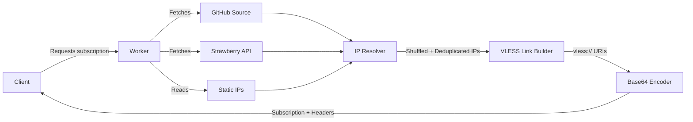

<p align="center">
  
</p><br><br/>

> ⏱️ 7 min · Level: <Badge type="tip" text="Beginner" />  

**Harmony** is a single-file Cloudflare Worker that generates VLESS proxy subscription links with automatically injected clean Cloudflare IP addresses. When a client requests your worker URL, Harmony dynamically fetches fresh clean IPs from multiple sources, builds fully-formed VLESS configurations across TLS and non-TLS transport groups, and returns a base64-encoded subscription — ready to paste into any sing-box or Xray-core client. The entire system runs at the edge with zero infrastructure, zero cold starts, and a 3-second timeout guarantee on all external fetches.

## Project Structure

The repository is intentionally minimal — one worker script, one IP data file, and a VitePress documentation site. There are no build steps for the worker itself; it deploys directly to Cloudflare.

```text
Harmony/
├── worker.js          ← The entire application (subscription generator)
├── cf-clean.json      ← Pre-compiled clean IP database (~18K lines)
├── package.json       ← VitePress docs tooling only
├── LICENSE            ← MIT License
├── README.md          ← Persian-language setup guide
└── docs/              ← This documentation site (VitePress)
    ├── index.md
    ├── en/1-overview.md
    ├── en/2-quick-start.md
    ├── en/.
    ├── en/.
    ├── en/.
    ├── en/16-fingerprint-and-early-data.md
    ├── en/17-cf-clean-json-reference.md
    └── public/
        ├── Harmony.svg
        └── logo.svg
```

<br/>

::: danger runtime dependencies
The worker has **zero runtime dependencies** — no `node_modules`, no bundler, no framework. You copy `worker.js` into the Cloudflare dashboard editor and deploy. That's it.  
:::

## Architecture Overview

Harmony follows a **fetch → resolve → build → encode** pipeline. Every client request triggers the full pipeline from scratch, ensuring IPs are always fresh on each subscription update.



## Core Components

Despite being a single file, `worker.js` contains four logically distinct subsystems. Understanding each one is the key to customizing Harmony effectively.

### 1. Configuration Layer (`USER_SETTINGS`)

The **`USER_SETTINGS`** object at the top of the file is the single source of truth for all runtime behavior. It defines your UUID, the number of IPs per group, early-data parameters, and an array of **configuration groups** — each group producing `ipCount` VLESS links with its own transport, TLS, and IP source settings.

| Property | Location | Purpose |
| --- | --- | --- |
| `uuid` | Line 32 | Your VLESS authentication UUID — must match your backend proxy |
| `ipCount` | Line 35 | Number of configs generated per group (default: 10) |
| `ed` / `eh` | Lines 38–39 | Early data size and header name for WebSocket optimization |
| `groups[]` | Lines 51–94 | Array of configuration groups (TLS, TCP, Emergency) |

### 2. IP Data Pipeline

Harmony draws clean IPs from **three independent sources**, shuffled and deduplicated per request. This layered approach provides resilience: if one source is unreachable, the others still populate their groups.

| Source Key | Origin | Description | Failure Mode |
| --- | --- | --- | --- |
| `dynamic1` | NiREvil's GitHub repo | Scanned every 6 hours by an automated IP scanner | Returns `[]` on timeout |
| `dynamic2` | Strawberry API (`strawberry.victoriacross.ir`) | Aggregates IPs from multiple upstream feeds | Returns `[]` on timeout |
| `static` | Hardcoded in `worker.js` (lines 102–971) | ~870 IPv6-mapped and plain IPv4 addresses + 28 domains | Always available |

### 3. VLESS Link Builder (`createVlessLink`)

Each group's IPs are fed into **`createVlessLink()`**, which constructs a fully-qualified `vless://` URI. The builder applies group-specific transformations: random port selection from the allowed list, path obfuscation via the `/random:N` directive, SNI case randomization when `randomizeSni: true`, and TLS parameter injection when `tls: true`.

The output format follows the standard VLESS URI scheme:

```text
vless://<uuid>@<ip>:<port>?path=<path>&encryption=none&type=ws&host=<host>&fp=<fp>&ed=<ed>&eh=<eh>&security=tls&sni=<sni>&alpn=<alpn>#<name>
```

### 4. Subscription Output

The final step encodes all VLESS URIs into a **base64 subscription** with custom HTTP headers that clients interpret as metadata:

| Header | Value | Purpose |
| --- | --- | --- |
| `Content-Type` | `text/plain; charset=utf-8` | Standard text response |
| `Profile-Update-Interval` | `6` | Client auto-refreshes every 6 hours |
| `Subscription-Userinfo` | `upload=...; download=...; total=...; expire=...` | Fake usage stats for client UI display |
| `Profile-Title` | `"Harmony"` (customizable via `?name=` param) | Subscription name shown in client |

The fake subscription info (`generateCakeSubscriptionInfo`) simulates a 440 TB quota with dynamically varying usage based on the current hour of day, so the client's traffic counter always appears active and realistic.

## Default Configuration Groups

Out of the box, Harmony ships with **three groups** that cover the most common deployment patterns. Each group independently fetches from its designated IP source and generates `ipCount` configurations.

| Group | Name | TLS | Ports | IP Source | SNI Randomization |
| --- | --- | --- | --- | --- | --- |
| 1 — TLS | `Harmonyᵀᴸˢ` | ✅ | 443, 8443, 2053, 2083, 2087, 2096 | `dynamic1` | ✅ |
| 2 — TCP | `Harmonyᵀᶜᴾ` | ❌ | 80, 8080, 8880, 2052, 2082, 2086, 2095 | `dynamic2` | ❌ |
| 3 — Emergency | `Harmonyᴱᴹˢ` | ✅ | 443, 2053 | `static` | ✅ |

The **Emergency group** uses only static IPs — it's your fallback when external APIs are unreachable. You can add, remove, or reorder groups freely in the `USER_SETTINGS.groups` array.

## Anti-Detection Features

Harmony bakes in several techniques that increase resilience against traffic analysis and censorship filtering:

- **SNI Case Randomization** — Each request randomly uppercases ~50% of characters in the SNI hostname (e.g., `iNdEx.HaRmOnIca01.wOrKeRs.DeV`), which is valid per RFC 7617 but disrupts case-sensitive DPI signatures.
- **Path Obfuscation** — The `/random:18` directive generates a fresh 18-character random path on every config build, making each VLESS link unique even within a single subscription response.
- **Client Fingerprint** — The `fp=chrome` parameter instructs Xray-core to mimic a Chrome browser's TLS ClientHello, blending the connection into normal HTTPS traffic.
- **Early Data** — The `ed=2560` parameter sends up to 2560 bytes of data in the first TLS flight, reducing round-trip latency for the initial WebSocket handshake.

## Key Feature Summary

| Feature | Implementation | Benefit |
| --- | --- | --- |
| Multi-source clean IPs | `dynamic1`, `dynamic2`, `static` pipeline | Redundancy against source outages |
| Per-request IP freshness | Full fetch on every client update | No stale IPs; always current |
| 3-second fetch timeout | `fetchWithTimeout()` with `AbortController` | Worker never hangs on slow sources |
| Fisher-Yates shuffle | `shuffleArray()` | Even distribution of IPs across configs |
| Fake subscription headers | `generateCakeSubscriptionInfo()` | Client UI shows realistic traffic stats |
| Base64 subscription output | `btoa(configsList.join("\n"))` | Universal client compatibility |
| Custom subscription name | `?name=` query parameter or `#hash` | Personalize subscription label in client |


## Next Steps

Now that you understand what Harmony does and how it's structured, follow this progression to get running:

1. **[Quick Start](./2-quick-start)** — Deploy Harmony to Cloudflare Workers in under 5 minutes.
2. **[Deploy to Cloudflare Workers](./3-deploy-to-cloudflare-workers)** — Detailed deployment walkthrough with screenshots.
3. **[Architecture Overview](./4-architecture-overview)** — Deep dive into the request lifecycle and data flow.
