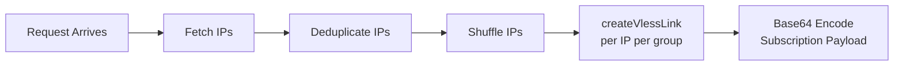
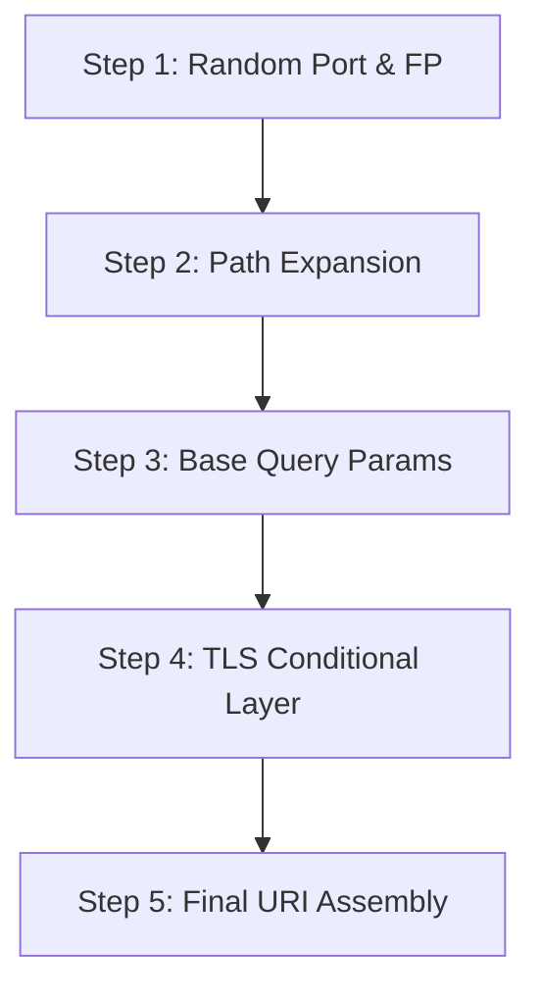

# VLESS Link Builder

> ⏱️ 8 min · Level: <Badge type="warning" text="Intermediate" />  

The VLESS Link Builder is Harmony's core generation engine — the function that transforms group configuration definitions and resolved clean IPs into fully-formed `vless://` URIs ready for client consumption. Every subscription response is a product of this builder being invoked once per IP per group, producing up to **30 individual VLESS links** (configurable via `ipCount`) that are then Base64-encoded and served as a subscription payload.

## How the Builder Fits the Pipeline

The link builder operates at the final stage of Harmony's request lifecycle. Before it runs, IPs have already been fetched, deduplicated, and shuffled. The builder's sole responsibility is to assemble syntactically correct VLESS URIs from the available data. The following diagram shows where `createVlessLink` sits in the end-to-end flow:



## The VLESS URI Format

Each link produced by the builder follows the standard VLESS share-link schema. Understanding this structure is essential for debugging misconfigured outputs:

```text
vless://<uuid>@<ip>:<port>?<queryParams>#<remark>
```

| Segment | Source | Example |
| --- | --- | --- |
| `uuid` | `USER_SETTINGS.uuid` | `a22bff60-a40a-4250-bde2-4c660e363b47` |
| `ip` | Resolved clean IP from group's `dataSource` | `104.16.148.32` or `[::ffff:6812:c5c]` |
| `port` | Random selection from `group.ports[]` | `443` |
| `queryParams` | Built by `URLSearchParams` object | See table below |
| `remark` | `encodeURIComponent(group.name)` | `Harmony%E1%B4%9B%E1%B4%B8%CB%A2` |

## Query Parameter Construction

The builder constructs query parameters in two phases — a **base set** that applies to all configurations, followed by **TLS-conditional parameters** that are only appended when `group.tls === true`.

### Base Parameters (Always Present)

| Parameter | Value Source | Description |
| --- | --- | --- |
| `path` | `group.path` (after `random:N` expansion) | WebSocket upgrade path |
| `encryption` | Hard-coded `"none"` | VLESS encryption mode |
| `type` | Hard-coded `"ws"` | Transport protocol (WebSocket) |
| `host` | `group.host` | Host header for the WebSocket handshake |
| `fp` | Random from `group.fp[]` | TLS client fingerprint (currently only `chrome`) |
| `ed` | `USER_SETTINGS.ed` | Max early data size (default `"2560"`) |
| `eh` | `USER_SETTINGS.eh` | Early data header name (default `"Sec-WebSocket-Protocol"`) |

### TLS-Conditional Parameters

| Parameter | Condition | Value Source | Description |
| --- | --- | --- | --- |
| `security` | `group.tls === true` | Hard-coded `"tls"` | TLS security mode |
| `sni` | `group.tls === true` | `group.sni || group.host` (optionally case-randomized) | Server Name Indication |
| `alpn` | `group.tls && group.alpn` | `group.alpn` | Application-Layer Protocol Negotiation |
| `allowInsecure` | `group.tls && group.allowInsecure` | Hard-coded `"1"` | Skip certificate validation |

::: warning ⚠️ NON-TLS GROUPS
**Non-TLS groups** (e.g., `Harmonyᵀᶜᴾ`) omit `security`, `sni`, `alpn`, and `allowInsecure` entirely — the builder does not emit empty or default values for these fields.
:::

## The `createVlessLink` Function — Step by Step

The builder executes four sequential operations per invocation:



### Step 1 — Random Port & Fingerprint Selection

Port and fingerprint are chosen uniformly at random from their respective arrays within the group definition. This means each invocation for the same IP can produce a different port, ensuring **port diversity** across the subscription set. With 6 TLS ports and 10 IPs, the default TLS group yields up to 6^10 possible port combinations across subscriptions.

```javascript
const randomPort = group.ports[Math.floor(Math.random() * group.ports.length)];
const randomFp = group.fp[Math.floor(Math.random() * group.fp.length)];
```

### Step 2 — Path Expansion (`random:N`)

The `group.path` field supports a special `random:N` syntax that is resolved at build time. When the builder encounters `"/random:18"`, it extracts the integer `N` and replaces the token with `N` random lowercase alphanumeric characters via `generateRandomPath`. This produces a unique, unpredictable WebSocket path per link, which contributes to Path Obfuscation.

| Path Template | Resolved Example |
| --- | --- |
| `/random:18` | `/a7k3m9x2p5w1n8q4r0` |
| `/random:14?ed=2048` | `/f2b8t6j1c5h0v3?ed=2048` |
| `/my-fixed-path` | `/my-fixed-path` (unchanged) |

::: tip TRAILING QUERY STRINGS
Note that `random:N` replacement preserves any trailing query string (e.g., `?ed=2048`) because only the `random:\d+` token is replaced, not the entire string.
:::

### Step 3 — Base Query Parameter Assembly

All parameters listed in the "Base Parameters" table above are assembled using the standard `URLSearchParams` constructor, which handles proper percent-encoding of values automatically.

### Step 4 — TLS Conditional Layer

If `group.tls` is truthy, the builder appends `security=tls` and derives the SNI value. The SNI resolution logic is:

1. Start with `group.sni` if non-empty, otherwise fall back to `group.host`
2. If `group.randomizeSni === true`, apply SNI Case Randomization — each character has a 50% chance of being uppercased

This produces SNI variants like `iNdEx.haRmOniCa01.wORkErS.dEv` from the original `index.harmonica01.workers.dev`, which helps evade case-sensitive DPI filters.

### Step 5 — Final URI Assembly

The complete VLESS URI is assembled as a template literal:

```javascript
return `vless://${settings.uuid}@${ip}:${randomPort}?${queryParams.toString()}#${ps}`;
```

The remark (`ps`) is the `encodeURIComponent`-encoded group name, ensuring Unicode superscript characters (like `ᵀᴸˢ`) are safely embedded in the URI fragment.

## Link Generation Orchestration

The builder is not called directly by the request handler — it is invoked within a double loop that iterates **groups × IPs**. This orchestration lives in `handleRequest` and controls how many links are produced per group:

```javascript
for (const group of USER_SETTINGS.groups) {
  const ipList = ipDataSources[group.dataSource] || [];
  const uniqueIPs = new Set();
  for (const ip of ipList) {
    if (uniqueIPs.size >= USER_SETTINGS.ipCount) break;
    if (!uniqueIPs.has(ip)) {
      const vlessUrl = createVlessLink(ip, group, USER_SETTINGS);
      configsList.push(vlessUrl);
      uniqueIPs.add(ip);
    }
  }
}
```

::: info KEY BEHAVIORS
- **IP cap per group**: Each group produces exactly `ipCount` (default 10) unique links — the `break` condition enforces this limit
- **Deduplication**: The `uniqueIPs` Set prevents duplicate IPs within a single group, even if the source array contains repeats
- **Cross-group independence**: The same IP can appear in multiple groups if it exists in multiple data sources — deduplication is per-group, not global
- **Empty source fallback**: If `ipDataSources[group.dataSource]` is undefined or empty, the group silently produces zero links

With the default configuration of 3 groups × 10 IPs each, the total output is **30 VLESS links** per subscription refresh.  
:::

## Configuration-to-Link Mapping

The following table shows how each field in a group definition maps to the final VLESS URI, using the default Group 1 (`Harmonyᵀᴸˢ`) as a concrete example:

| Group Field | Value | URI Impact |
| --- | --- | --- |
| `name` | `"Harmonyᵀᴸˢ"` | Fragment/remark: `#Harmony%E1%B4%9B%E1%B4%B8%CB%A2` |
| `host` | `"index.harmonica01.workers.dev"` | Query param: `host=index.harmonica01.workers.dev` |
| `sni` | `"index.harmonica01.workers.dev"` | Query param: `sni=...` (case-randomized) |
| `path` | `"/random:18"` | Query param: `path=/a7k3m9x2p5w1n8q4r0` |
| `tls` | `true` | Adds `security=tls`, `sni`, `alpn` params |
| `allowInsecure` | `false` | Omits `allowInsecure` param |
| `ports` | `["443","8443","2053","2083","2087","2096"]` | One randomly selected per link |
| `alpn` | `"http/1.1"` | Query param: `alpn=http/1.1` |
| `fp` | `["chrome"]` | Query param: `fp=chrome` |
| `dataSource` | `"dynamic1"` | Determines which IP pool feeds this group |
| `randomizeSni` | `true` | SNI characters receive random casing |

## Utility Functions

Three utility functions support the link builder:

| Function | Purpose | Algorithm |
| --- | --- | --- |
| `generateRandomPath(length)` | Produce random alphanumeric path segment | Character-by-character from `a-z0-9` alphabet |
| `randomizeCase(str)` | Randomly upper/lower case each character | 50% probability per character |
| `shuffleArray(array)` | Fisher-Yates shuffle for IP lists | In-place swap from last element backward |

::: info ARRAY COPYING
The `shuffleArray` function operates on a **copy** (`array.slice()`) rather than the original, ensuring the deduplicated IP sets remain unmodified for potential reuse across groups. Combined with `new Set(staticIPs)` deduplication in `handleRequest`, this guarantees each subscription refresh yields a random ordering without corrupting source data.
:::

## Complete Output Example

Given the default configuration and a resolved IP of `104.16.148.32`, the builder produces a URI like:

```text
vless://a22bff60-a40a-4250-bde2-4c660e363b47@104.16.148.32:2053?path=%2Fa7k3m9x2p5w1n8q4r0&encryption=none&type=ws&host=index.harmonica01.workers.dev&fp=chrome&ed=2560&eh=Sec-WebSocket-Protocol&security=tls&sni=iNdEx.haRmOniCa01.wORkErS.dEv&alpn=http%2F1.1#Harmony%E1%B4%9B%E1%B4%B8%CA%92
```

::: info `PERCENT-ENCODING`
Note how `URLSearchParams` automatically percent-encodes the path (`/` → `%2F`), alpn (`http/1.1` → `http%2F1.1`), and the remark retains its Unicode superscript encoding.
:::

<br/>

## What Comes Next

The VLESS links produced by this builder are collected into a `configsList` array and passed to the Base64 encoding stage. 

To understand how the final subscription payload is assembled and delivered to clients, continue with **[Base64 Subscription Output](./12-base64-subscription-output)**.  
For details on the fake metadata headers attached to the response, see **[Fake Subscription Info Headers](./13-fake-subscription-info-headers)**.  