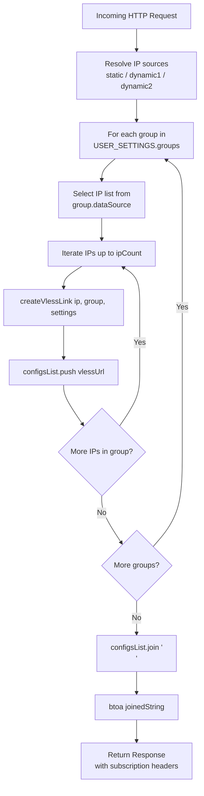
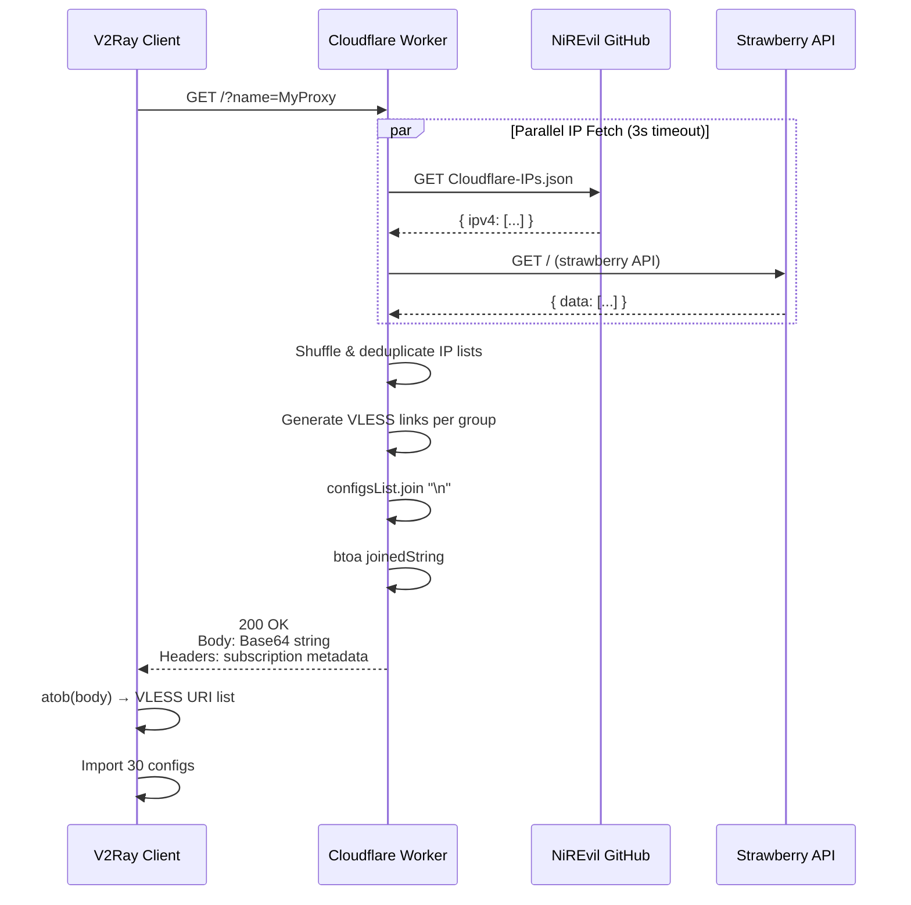

# Base64 Subscription Output

> ⏱️ 7 min · 🟡 Level: Intermediate

Harmony's sole HTTP response is a **Base64-encoded string** of newline-joined VLESS links — the standard interchange format that every V2Ray/Xray/sing-box client expects when importing a subscription URL. This page dissects the complete output pipeline: how individual links are collected, how they are serialized and encoded, and what HTTP metadata accompanies the final payload.

## 🔄 Subscription Assembly Pipeline

Before any encoding occurs, the worker must gather VLESS links from every configured group. The `handleRequest` function orchestrates this in three sequential stages: **IP resolution → per-group link generation → list finalization**. Each group draws from its designated IP source (static, dynamic1, or dynamic2), and for every unique IP it produces one VLESS link — capped at `ipCount` links per group (default: 10). With three groups by default, this yields **30 VLESS configurations** in the final list.



::: info `FRESH IP EVERY REQUEST`
The `configsList` array is initialized empty at the start of each request, meaning every subscription update fetches **fresh IPs** and generates **new random paths and SNI casing** — there is no caching between requests.
:::

## 🔐 The Encoding Mechanism

The encoding step is a single, deliberate expression:

```javascript
btoa(configsList.join("\n"))
```

This performs two operations in sequence:

1. **`configsList.join("\n")`** — Concatenates every VLESS link in the array with a `\n` (LF) newline delimiter. This is the canonical multi-configuration format specified by the V2Ray subscription convention: each link occupies exactly one line, with no trailing newline.

2. **`btoa(…)`** — Applies standard Base64 encoding via the Web API built into the Cloudflare Workers runtime. The `btoa` function takes a binary string and returns its Base64 representation. No custom alphabet, no URL-safe variant — this is the vanilla Base64 that clients decode with a simple `atob()`.

::: danger `WHY BASE64?`
The V2Ray subscription protocol mandates it. Clients like v2rayN, Nekoray, sing-box, and Clash Meta all expect the raw response body to be a Base64 string, which they decode to recover the newline-separated URI list. Harmony follows this contract exactly.
:::

### Decoded Output Structure

After Base64 decoding, a client receives a plaintext string structured like this:

```text
vless://uuid@ip1:port1?params#Harmonyᵀᴸˢ
vless://uuid@ip2:port2?params#Harmonyᵀᴸˢ
...                        (10 links per group)
vless://uuid@ip11:port11?params#Harmonyᵀᶜᴾ
...                        (10 links per group)
vless://uuid@ip21:port21?params#Harmonyᴱᴹˢ
...                        (10 links per group)
```

Each line is a complete, self-contained VLESS URI produced by the VLESS Link Builder. The number of lines equals `groups.length × ipCount` (default: 3 × 10 = **30 lines**).

## 📋 Response Headers and Subscription Metadata

The Base64 body is only half the contract. Harmony attaches several **subscription-specific HTTP headers** that clients interpret to display quota information and schedule automatic updates:

| Header | Value | Purpose |
| --- | --- | --- |
| `Content-Type` | `text/plain; charset=utf-8` | Declares the response as Base64-encoded text (not JSON, not binary) |
| `Profile-Update-Interval` | `6` | Tells clients to re-fetch the subscription every **6 hours** |
| `Subscription-Userinfo` | `upload=…; download=…; total=…; expire=…` | Fake traffic statistics — see Fake Subscription Info Headers |
| `Profile-Title` | Custom name or `"Harmony"` | Subscription display name in the client, derived from URL parameters |

### Profile Title Resolution

The `Profile-Title` header is set dynamically from the request URL using a **priority cascade**:

1. **`?name=` query parameter** — e.g., `https://your-worker.dev/?name=MyProxy` → title becomes `"MyProxy"`
2. **URL hash fragment** — e.g., `https://your-worker.dev/#MyProxy` → title becomes `"MyProxy"` (fallback)
3. **Default** — If neither is provided, the title defaults to `"Harmony"`

```javascript
const subNameParam = url.searchParams.get("name");       // Priority 1
const subNameHash = url.hash ? decodeURIComponent(url.hash.substring(1)) : null; // Priority 2
const profileTitle = subNameParam || subNameHash || "Harmony";  // Fallback
```

::: tip `MULTI-PROFILE SUPPORT`
This means a single worker deployment can serve differently-named subscriptions to different clients simply by varying the URL.
:::

## 🛡️ Error Handling: Graceful Degradation

When the subscription generation fails entirely (e.g., all dynamic IP sources are unreachable and no static fallback exists), the worker does **not** return an HTTP error. Instead, it returns a valid Base64-encoded error message:

```javascript
return new Response(btoa("# Error generating configurations"), {
  status: 200,
  headers: {
    "Content-Type": "text/plain; charset=utf-8",
  },
});
```

::: warning ⚠️ `KEY DESIGN DECISIONS`
- **HTTP 200** is returned intentionally — many proxy clients treat non-200 responses as a subscription failure and may disable the profile entirely. Returning 200 with an error comment inside the Base64 payload prevents this.
- **The error message is Base64-encoded** — maintaining format consistency so clients that blindly decode the body won't crash on unexpected plaintext.
- **Subscription headers are omitted** — no fake userinfo or update interval is attached to error responses, avoiding misleading quota display.
- **The `#` prefix** — mirrors the comment convention in V2Ray subscription format, where lines starting with `#` are treated as comments and ignored during parsing.
:::

::: info `DEBUGGING`
If you encounter `# Error generating configurations` after decoding your subscription, check that at least one IP source is reachable. The static IP list in `staticIPs` serves as the ultimate fallback — ensure it's not empty.
:::

## 🔁 Complete Request-Response Flow

The following diagram captures the full lifecycle of a subscription request, from HTTP ingress to the Base64-encoded response:



::: info `PARALLEL FETCH SAFETY`
The `Promise.all` with 3-second timeouts ensures that slow or unresponsive IP sources don't block the entire response. If a source fails, it gracefully degrades to an empty array, and the affected group produces zero configs (unless it falls back to `static`).
:::

## ⚙️ Configuration Parameters Affecting Output

The shape and size of the Base64 payload is controlled by two `USER_SETTINGS` fields:

| Parameter | Location | Default | Effect on Output |
| --- | --- | --- | --- |
| `ipCount` | Line 35 | `10` | Number of VLESS links **per group** — total links = `ipCount × groups.length` |
| `groups[]` | Lines 51–94 | 3 groups | Each group generates its own batch of links; more groups = more lines in decoded output |

::: tip `TRADE-OFFS`
Increasing `ipCount` to 20 with 3 groups would produce 60 VLESS links, making the Base64 payload roughly twice as large. The trade-off is **more redundancy** (more IPs to rotate through) vs. **larger response size** and **slower client parsing**.
:::

<br/>

## 💠 Next Steps
Now that you understand how the final Base64 output is assembled and delivered, explore the adjacent pieces of the subscription pipeline:

- **[VLESS Link Builder](./11-vless-link-builder.md)** — How each individual `vless://` URI is constructed before it enters `configsList`  
- **[Fake Subscription Info Headers](./13-fake-subscription-info-headers.md)** — How the `Subscription-Userinfo` header fabricates realistic traffic statistics  