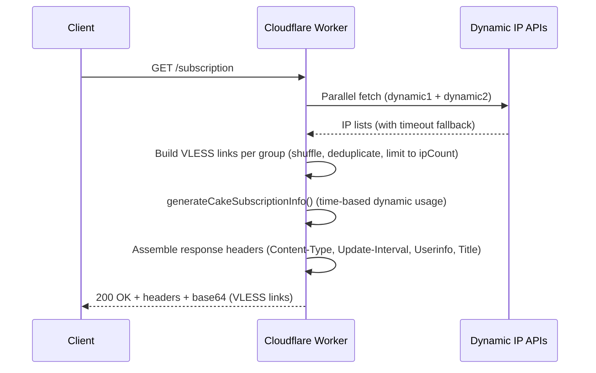

# Fake Subscription Info Headers

Harmony injects **synthetic subscription metadata** into every HTTP response, enabling V2Ray/Xray-compatible clients to display plausible traffic quotas, expiry dates, and update intervals — even though the worker operates without any real accounting backend. This mechanism is essential for client compatibility: most proxy clients (v2rayN, Nekobox, Sing-box, Clash Meta) parse the `Subscription-Userinfo` header to render usage dashboards, and will malfunction or refuse to import subscriptions that omit it entirely.

## The Subscription-Userinfo Contract

The V2Ray subscription convention defines a strict header format that clients parse to populate their UI. Harmony constructs this string via the `generateCakeSubscriptionInfo` function, which outputs a semicolon-delimited payload with four fields:

```http
upload=<bytes>; download=<bytes>; total=<bytes>; expire=<unix_timestamp>
```

| Field | Type | Description | Harmony Value |
| --- | --- | --- | --- |
| `upload` | Integer (bytes) | Simulated uploaded traffic | ≈ 50% of `used` |
| `download` | Integer (bytes) | Simulated downloaded traffic | ≈ 50% of `used` |
| `total` | Integer (bytes) | Total traffic quota | `total_TB × 1024⁴` |
| `expire` | Unix timestamp | Subscription expiry time | `now + expire_years × 365 × 86400` |

The upload and download values are split equally from the computed `used` total, presenting a balanced consumption profile that appears natural to client dashboards.

## CAKE_SETTINGS — Configuration Parameters

The fake subscription parameters are centralized in the `CAKE_SETTINGS` constant, which controls the magnitude and dynamics of the simulated traffic data:

```javascript
const CAKE_SETTINGS = {
  total_TB: 440,          // Total traffic quota in Terabytes
  base_GB: 88000,         // Base usage always shown (in Gigabytes)
  daily_growth_GB: 450,   // Daily traffic growth (in Gigabytes)
  expire_years: 2,        // Validity period in years (dynamic)
};
```

| Parameter | Default | Unit | Purpose |
| --- | --- | --- | --- |
| `total_TB` | 440 | Terabytes | Sets the apparent total quota — large enough to never trigger "quota exceeded" warnings in clients |
| `base_GB` | 88,000 | Gigabytes | Floor value for `used` — ensures the dashboard always shows meaningful consumption even at midnight |
| `daily_growth_GB` | 450 | Gigabytes | Rate of apparent daily usage growth — simulates gradual, realistic traffic accumulation |
| `expire_years` | 2 | Years | How far into the future the expiry timestamp is set — prevents "subscription expired" states |

## Time-Driven Dynamic Usage

::: danger `Time-Correlated Usage Curve`
The critical design insight is that **the reported usage is not static** — it advances throughout the day based on the current hour, creating the illusion of active, real-time consumption.
:::

The function derives a `dailyGrowth` value proportional to the elapsed fraction of the day:

```javascript
dailyGrowth = (currentHour / 24) × daily_growth_GB × 1024³
used = base_GB × 1024³ + dailyGrowth
```

At midnight (hour 0), `used` equals the base value alone. By 23:59, `used` has climbed by nearly the full `daily_growth_GB` increment. This creates a **monotonic, time-correlated usage curve** that mimics real subscription behavior — each client refresh within the same day returns a slightly higher usage than the last.

## Response Header Assembly

Once the subscription info string is generated, Harmony attaches it to the response alongside two additional standard headers that complete the subscription metadata envelope:

```javascript
const headers = {
  "Content-Type": "text/plain; charset=utf-8",
  "Profile-Update-Interval": "6",
  "Subscription-Userinfo": subInfo,
};

if (profileTitle) {
  headers["Profile-Title"] = profileTitle;
}
```

| Header | Value | Client Behavior |
| --- | --- | --- |
| `Content-Type` | `text/plain; charset=utf-8` | Signals base64-encoded payload encoding |
| `Profile-Update-Interval` | `6` | Client auto-refreshes subscription every **6 hours**, ensuring fresh clean IPs are fetched periodically |
| `Subscription-Userinfo` | Dynamic (see above) | Populates traffic dashboard, quota bars, and expiry display |
| `Profile-Title` | From `?name=` param or `#hash` or `"Harmony"` | Names the subscription profile in the client's sidebar — derived from URL query parameter, fragment, or fallback default |

::: details Customizing the Profile Title
The `Profile-Title` resolution follows a priority chain: the `name` query parameter takes precedence, then the URL fragment (`#`), then the hardcoded default `"Harmony"`. This allows users to customize the profile name directly in the subscription URL (e.g., `https://worker.dev/?name=MyProfile`).
:::

## Why "Fake" Headers Matter

::: warning `Architectural, Not Adversarial`
The term **"fake"** here is architectural, not adversarial. Harmony is a stateless Cloudflare Worker — it has no database, no user accounts, and no traffic accounting.
:::

Without synthetic headers, clients would either:

1. **Refuse to import** the subscription entirely (some clients validate the presence of `Subscription-Userinfo` before accepting).
2. **Display broken or empty dashboards** with zeroed-out traffic bars and missing expiry dates.
3. **Fail to auto-refresh** without `Profile-Update-Interval`, forcing manual updates to get fresh clean IPs.

The fake headers solve all three problems simultaneously with zero operational overhead — no storage, no computation beyond simple arithmetic, and no external dependencies. The time-based growth function adds a thin layer of dynamism that prevents the dashboard from appearing frozen or suspiciously static.

::: info `Safe Customization`
Modifying `CAKE_SETTINGS` is safe and has no side effects on proxy functionality — the headers are purely informational for the client UI. Increase `total_TB` if your client warns about quota limits; decrease `daily_growth_GB` if the usage curve appears unrealistically steep for your use case.
:::

## Header Processing Flow in Context

The fake subscription info generation is the **final step** in Harmony's request pipeline, executed after all VLESS configurations have been assembled and before the base64-encoded response is returned:

::: details Click here to see the processing flow

:::

The subscription info headers are generated at line 1068, immediately after the VLESS configuration loop completes and immediately before the `Response` object is constructed. This ordering guarantees that the headers always reflect the current server time, even if IP fetching or link generation took several seconds.

## 💠 Next Steps

Learn how Harmony randomizes SNI casing to evade DPI-based filtering → **[SNI Case Randomization](./14-sni-case-randomization.md).**  