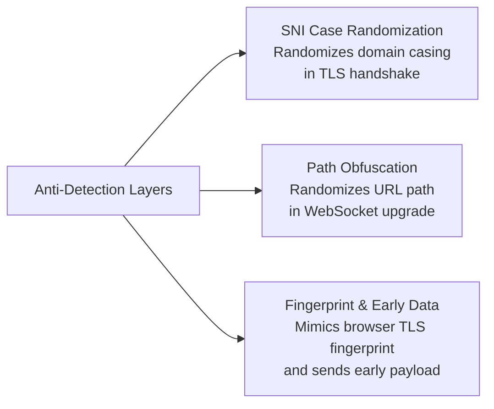

# Path Obfuscation

> ⏱️ 7 min · Level: <Badge type="warning" text="Intermediate" />  


Path obfuscation is Harmony's built-in mechanism for randomizing the WebSocket path in every VLESS configuration it generates. Instead of broadcasting a static, predictable path like `/ws` or `/vless`, each subscription refresh produces a unique, non-guessable path — making automated probing and signature-based filtering significantly harder. The feature is configured directly inside each group's `path` field and requires zero additional dependencies.

## The `random:N` Syntax

The obfuscation is driven by a compact **`random:N`** token embedded in the group's `path` string. During link generation, the token is replaced by `N` random characters drawn from the **lowercase alphanumeric** alphabet (`a–z`, `0–9`). The replacement is performed **per-config** — meaning every single VLESS link in the subscription receives its own independently generated path.

| Token Format | Meaning | Example Input | Example Output |
| --- | --- | --- | --- |
| `/random:N` | Replace token with N random chars | `/random:18` | `/k7qm2bxf9p4jwnhta` |
| `/random:N?params` | Token + preserved query string | `/random:14?ed=2048` | `/g5n3v8a1c9x2m7?ed=2048` |

::: info Entropy Calculation
The `N` value determines the **entropy** of the generated path. Each character is chosen from a 36-character pool (26 letters + 10 digits), so a path of length `N` provides approximately **N × 5.17 bits** of entropy — enough to make brute-force discovery impractical at modest lengths.
:::

## How It Works: Processing Pipeline

The path obfuscation logic lives inside the `createVlessLink()` function and executes on every single configuration generated. Here is the exact flow:

**Click to view the flowchart:**  

```mermaid
flowchart TD
    A[Group path value<br/>e.g. /random:18] --> B{Contains random:?}
    B -- No --> C[Use path as-is<br/>(static path)]
    B -- Yes --> D[Extract N via regex<br/>/random:(\d+)/]
    D --> E[Call generateRandomPath(N)]
    E --> F[Replace token with<br/>random string]
    F --> G[Append to VLESS URL<br/>as path query param]
```

The regex `random:(\d+)` captures the digit portion, and the entire `random:N` token (not just the digit) is replaced with the generated string. Any text surrounding the token — such as a leading `/` or trailing query parameters like `?ed=2048` — is **preserved intact**. If the regex fails to match or an exception is thrown, the original path string is kept unchanged as a safe fallback.

## The Random Path Generator

The `generateRandomPath(length)` function is the engine behind the obfuscation. It produces a string of the requested length using the character set `abcdefghijklmnopqrstuvwxyz0123456789`. Each character is selected independently via `Math.random()`, giving a **uniform distribution** across the 36-character pool.

```javascript
function generateRandomPath(length) {
  let result = "";
  const characters = "abcdefghijklmnopqrstuvwxyz0123456789";
  const charactersLength = characters.length;
  for (let i = 0; i < length; i++) {
    result += characters.charAt(Math.floor(Math.random() * charactersLength));
  }
  return result;
}
```

::: danger Character Set Design
The character set is intentionally lowercase-only (no uppercase) to avoid potential case-sensitivity issues on intermediate proxies or CDNs that may normalize paths. The inclusion of digits increases the pool size from 26 to 36 without introducing any URL-unsafe characters.
:::

## Configuration in Practice

Each of the three default groups demonstrates a different path configuration pattern. Here is a side-by-side comparison:

| Group | Name | Path Config | Resolved Example | Notes |
| --- | --- | --- | --- | --- |
| 1 (TLS) | Harmonyᵀᴸˢ | `/random:18` | `/a3kx9f7m2p5jwnbq1` | Pure random path, no query params |
| 2 (TCP) | Harmonyᵀᶜᴾ | `/random:18` | `/t8v4c6n1g5r2b9m7h` | Same length, non-TLS group |
| 3 (Alt TLS) | Harmonyᴱᴹˢ | `/random:14?ed=2048` | `/f9k3w7p2x1n4?ed=2048` | Shorter random + early-data param |

**Group 3** is particularly instructive: it uses `/random:14?ed=2048`, which generates 14 random characters **and** preserves the `?ed=2048` query parameter. This is the recommended pattern when you need to pass additional WebSocket parameters alongside the obfuscated path.

## Choosing the Right Path Length

The `N` value in `random:N` controls a direct trade-off between obfuscation strength and URL length. Here is a practical guide:

| Length (`N`) | Entropy (bits) | Brute-Force Space | Recommendation |
| --- | --- | --- | --- |
| 8 | ~41 | 2.8 × 10¹² | Minimum viable; sufficient for most scenarios |
| 14 | ~72 | 6.1 × 10²¹ | Good balance; used by Group 3 with query params |
| 18 | ~93 | 1.0 × 10²⁸ | Strong; default for Groups 1 & 2 |
| 24+ | ~124+ | 10³⁷+ | Overkill; adds URL length with diminishing returns |

::: tip Best Practice
Values between **14 and 18** are the sweet spot. Going below 8 reduces the search space to a level where automated scanners could theoretically enumerate paths. Going above 24 provides negligible additional security while making the VLESS URL unnecessarily long — some clients may truncate very long URLs.
:::

## Static Paths vs. Obfuscated Paths

You are not forced to use `random:N`. If a group's `path` field does **not** contain the `random:` token, it is used verbatim — every config in that group will share the identical path. This is useful for debugging or for environments where path stability is required.

| Mode | Path Config | Behavior | Use Case |
| --- | --- | --- | --- |
| **Obfuscated** | `/random:18` | New path per config per refresh | Production; censorship resistance |
| **Static** | `/ws-vless` | Same path across all configs | Debugging; controlled environments |
| **Hybrid** | `/prefix-random:8/suffix` | Partial randomization | Custom path structures |

## Relationship to Other Anti-Detection Features

Path obfuscation is one layer in Harmony's multi-layer anti-detection strategy. It operates on the **URL path** component, which is distinct from the other obfuscation surfaces:

**Anti-Detection Layers Overview**  



Each layer targets a different inspection point in the network stack. **SNI randomization** confuses DPI systems that examine the TLS ClientHello. **Path obfuscation** defeats filters that inspect the HTTP upgrade request URI. **Fingerprint spoofing** makes the connection itself indistinguishable from a legitimate browser session. Together, they create overlapping uncertainty for any adversary performing traffic analysis.

## Customizing Path Obfuscation

To modify the obfuscation for your deployment, edit the `path` field in any group inside `USER_SETTINGS`:

```javascript
// worker.js — USER_SETTINGS.groups[0]
{
  name: "Harmonyᵀᴸˢ",
  host: "index.harmony.workers.dev",
  sni: "index.harmony.workers.dev",
  path: "/random:18",  // ← Change N here, or use a static path
  tls: true,
  // ...
}
```

::: info Common Modifications
- **Increase entropy:** Change `/random:18` to `/random:24` for more randomness per config.
- **Add a prefix:** Use `/api-random:12` to generate paths like `/api-k7qm2bxf9p4j`. The regex only matches `random:N`, so any surrounding text survives.
- **Combine with query params:** Use `/random:16?ed=2048` to inject early-data alongside the obfuscated path, as Group 3 demonstrates.
- **Disable for a group:** Set `path: "/ws"` or any static string without `random:` to skip obfuscation for that group only.
:::

## Next Steps

With path obfuscation understood, the remaining anti-detection layer to explore is how Harmony mimics real browser connections:  

- **[Fingerprint and Early Data](./16-fingerprint-and-early-data)** — Learn how `fp`, `ed`, and `eh` parameters make your VLESS connection's TLS handshake indistinguishable from a Chrome browser.  