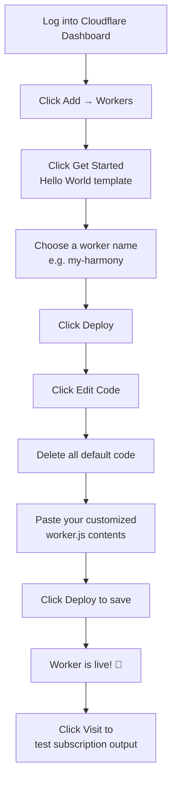
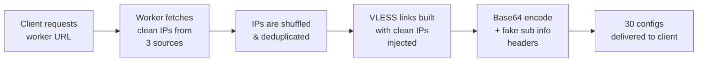

# Quick Start

> ⏱️ 8 min · 🟢 Level: Beginner

Get Harmony running in under five minutes. This page walks you through the essential steps: obtaining your VLESS credentials, customizing the worker script, deploying to Cloudflare, and using your subscription link. No prior experience with Cloudflare Workers is assumed.

## Prerequisites

Before you begin, ensure you have the following:

| Requirement | Purpose | How to Obtain |
| --- | --- | --- |
| **Cloudflare account** | Hosts the Worker that generates subscriptions | cloudflare.com/sign-up |
| **An existing VLESS config** | Provides the **UUID** and **hostname** Harmony needs | Created via any VLESS worker (see below) |
| **A proxy client** | Imports and uses the generated subscription link | v2rayN, NekoBox, Clash Meta, Streisand, etc. |

**Why do I need an existing VLESS config?** Harmony is a **subscription generator**, not a proxy server itself. It takes your existing VLESS connection details and amplifies them — automatically injecting clean Cloudflare IPs into 30 distinct configurations. You need the UUID and hostname from a working VLESS setup as the foundation.

## Step 1 — Obtain Your UUID and Hostname

If you already have a working VLESS configuration, extract the **UUID** and **hostname** from it and skip to Step 2.

If you don't yet have a VLESS config, create one using any of these popular workers:

| Worker Project | Description |
| --- | --- |
| **ZiZifn (Rust rewrite)** | Rust-based edgetunnel — fast and lightweight |
| **BPB Worker Panel** | Feature-rich panel with UI management |
| **cmliu/edgetunnel** | Community fork with additional transport options |

Deploy one of these as a Cloudflare Worker first. Once it's running, copy the **UUID** (e.g. `a22bff60-a40a-4250-bde2-4c660e363b47`) and the **hostname** (e.g. `your-worker.your-subdomain.workers.dev`) from that config — you'll paste them into Harmony next.

## Step 2 — Customize worker.js

Download or copy the worker.js file from the repository, then make **three targeted edits** in the `USER_SETTINGS` object at the top of the file.

### 2a. Replace the UUID

Find line 32 and replace the default UUID with your own:

```javascript
// Line 32 — Before
uuid: "a22bff60-a40a-4250-bde2-4c660e363b47",

// Line 32 — After (your actual UUID)
uuid: "your-uuid-here",
```

### 2b. Replace Hostname and SNI in Each Group

Harmony defines three configuration groups. You must update the `host` and `sni` fields in **every group** that uses your VLESS config. For groups deployed on Cloudflare Workers, `sni` should always equal `host`.

| Group | Lines | Fields to Update | Notes |
| --- | --- | --- | --- |
| **Group 1 (TLS)** | 55–56 | `host`, `sni` | Your primary TLS worker hostname |
| **Group 2 (TCP)** | 69–70 | `host` | `sni` must remain `""` for non-TLS |
| **Group 3 (Emergency TLS)** | 83–84 | `host`, `sni` | Fallback config — can use a different worker |

### 2c. Save the File

After making the replacements, save the file. The rest of the settings (`path`, `ports`, `alpn`, `dataSource`, etc.) use sensible defaults that work out of the box — you can tune them later via the Deep Dive pages.

::: warning ⚠️ NEVER EVER
**Never share your UUID publicly.** It's the authentication token for your VLESS proxy — anyone with it can use your connection.
:::

## Step 3 — Deploy to Cloudflare Workers

The following flowchart illustrates the complete deployment sequence:



Follow these steps in detail:

1. **Log in** to your Cloudflare dashboard.
2. In the top navigation bar, click **Add** (or the **+** icon on mobile), then select **Workers**.
3. Click **Get Started** next to the "Start with Hello World!" option.
4. Choose a name for your worker (e.g. `my-harmony`) and click **Deploy**.
5. After the worker is created, click **Edit Code**.
6. **Delete** all the default "Hello World" code in the editor.
7. **Paste** the entire contents of your customized `worker.js` file.
8. Click the blue **Deploy** button in the upper-right corner to apply changes.

::: info Important
The filename inside the editor must remain `worker.js` — this is required by Cloudflare Workers runtime.
:::

## Step 4 — Get Your Subscription Link

Once the worker is deployed, click the **Visit** button in the editor. A new browser tab will open displaying a Base64-encoded block of text — this is your subscription output. The **URL in the address bar** of that tab is your subscription link.

It will look similar to:

```text
https://my-harmony.<your-subdomain>.workers.dev
```

You can optionally append a `?name=` parameter to set a custom profile title in your client:

```text
https://my-harmony.<your-subdomain>.workers.dev?name=MyProxy
```

## Step 5 — Import into Your Client

Add the subscription link to any proxy client that supports the **sing-box** or **Xray** core:

| Client | Platform | Core |
| --- | --- | --- |
| v2rayN | Windows | Xray |
| NekoBox | Android | sing-box |
| Exclave | Android | sing-box |
| Clash Meta / mihomo | Cross-platform | sing-box |
| Hiddify | Android | Xray |
| Streisand | iOS | Xray |
| v2rayNG | Android | Xray |

1. Open your client and find the **Subscription** or **Profile** section.
2. Add a new subscription and paste your Harmony worker URL.
3. Click **Update Subscription** — the client will fetch and decode all 30 configurations.
4. Select a config and connect.

## What Happens When You Update?

Every time you click **Update Subscription** in your client, Harmony performs this pipeline:



This produces **30 VLESS configurations** by default (10 per group × 3 groups), each routed through a different clean Cloudflare IP for maximum reliability. The `Profile-Update-Interval: 6` header tells your client to auto-refresh every 6 hours, so your IP list stays fresh.

## Troubleshooting

| Symptom | Likely Cause | Fix |
| --- | --- | --- |
| Blank or empty output | UUID or hostname is still the default placeholder | Verify you replaced values in lines 32, 55–56, 69–70, 83–84 |
| Client shows 0 configs after import | Pasting the Base64 text instead of the URL | Copy the worker URL, not the base64 response |
| Only 10–20 configs instead of 30 | One or more IP sources returned empty | This is normal if a source is temporarily down; all 3 sources are independent |
| Configs connect but no internet | UUID doesn't match the one in your actual VLESS worker | The UUID in Harmony must match the UUID in the VLESS proxy worker you created |

<br/>

::: info NOTE
If dynamic IP sources are blocked in your region, the static IPs in Group 3 still provide a working fallback. You can also replace the static IPs in the `staticIPs` array (lines 102–971) with your own known-good addresses.
:::

## Next Steps
You now have a working Harmony subscription generating fresh VLESS configs with clean IPs. Here's where to go next:

- **[Deploy to Cloudflare Workers](./3-deploy-to-cloudflare-workers)** — production deployment best practices, custom domains, and routing
- **[Architecture Overview](./4-architecture-overview)** — understand how the IP pipeline, link builder, and subscription encoder work together
- **[UUID and Hostname Setup](./6-uuid-and-hostname-setup)** — deep configuration of your identity parameters
- **[IP Data Sources](./8-ip-data-sources)** — customize which clean IP sources Harmony fetches from
