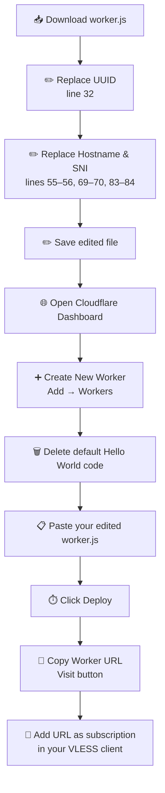
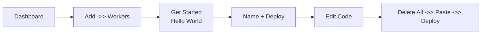

# Deploy to Cloudflare Workers

> ⏱️ 8 min · 🟢 Level: Beginner

Harmony deploys as a single-file Cloudflare Worker — no build tools, no dependencies, no wrangler config. You edit `worker.js` in-place, paste it into the Cloudflare dashboard, and the resulting Worker URL becomes your live VLESS subscription endpoint. Every time a client calls "Update Subscriptions", the Worker re-fetches fresh clean IPs and regenerates all configurations on the fly.

## 📋 Prerequisites

Before you begin the deployment, you need two pieces of information extracted from an **existing VLESS proxy Worker** (created separately via tools like ZiZifn, BPB, or CMLiu):

| Prerequisite | What It Is | Where to Find It |
| --- | --- | --- |
| **UUID** | Your VLESS user identifier (v4 format) | Inside your existing VLESS config string, after `vless://` and before `@` |
| **Hostname** | Your proxy Worker's `*.workers.dev` domain | In your Cloudflare dashboard under Workers → your Worker → **Preview** / **Triggers** tab |

If you don't yet have a VLESS proxy Worker, create one first using any compatible generator, then return here. Harmony is a **subscription generator** — it wraps your existing proxy endpoint with automatic clean IP injection.

##  Deployment Flow

The entire process follows a linear path from download to live subscription:



## Step 1 — Download and Edit worker.js

Download or copy the raw worker.js file from the repository. Open it in any text editor — **Notepad++** on Windows, **MT Manager** on Android, or the GitHub web editor all work. You will make exactly **three categories of edits** in the `USER_SETTINGS` object at the top of the file:

### 1a. Replace the UUID

On **line 32**, replace the default UUID with your own:

| Line | Before | After |
| --- | --- | --- |
| 32 | `uuid: "a22bff60-a40a-4250-bde2-4c660e363b47"` | `uuid: "your-actual-uuid-here"` |

### 1b. Replace Hostname and SNI per Group

The `groups` array contains three configuration groups by default. Each group's `host` and `sni` must point to **your** proxy Worker's domain. For Workers hosted on Cloudflare, the SNI value is always identical to the hostname.

| Group | Purpose | `host` Line | `sni` Line | Note |
| --- | --- | --- | --- | --- |
| **Group 1** (TLS) | `Harmonyᵀᴸˢ` | Line 55 | Line 56 | Both values = your Worker hostname |
| **Group 2** (Non-TLS) | `Harmonyᵀᶜᴾ` | Line 69 | Line 70 | SNI must remain `""` (empty) |
| **Group 3** (Alt TLS) | `Harmonyᴱᴹˢ` | Line 83 | Line 84 | Both values = your Worker hostname |

<br/>

::: info NOTE
For Group 2 (non-TLS/TCP), the `sni` field **must stay empty** — this is not a placeholder. Non-TLS configurations do not use Server Name Indication. Only replace the `host` value on line 69.
:::

### 1c. Save the File

Save the edited file locally. The filename **must remain** `worker.js` — Cloudflare Workers require this exact filename when pasting code into the dashboard editor.

## Step 2 — Create the Worker in Cloudflare

Navigate to the Cloudflare dashboard and follow these steps:

| Step | Action | Detail |
| --- | --- | --- |
| 1 | **Add a Worker** | Click the **Add** icon (or **+** on mobile) in the top toolbar, then select **Workers** |
| 2 | **Start from Hello World** | Click **Get Started** next to "Start with Hello World!" |
| 3 | **Name your Worker** | Choose any name (e.g., `harmony-sub`). Click **Deploy** |
| 4 | **Open the editor** | After deployment completes, click **Edit Code** |
| 5 | **Clear default code** | Delete all of the default Hello World content |
| 6 | **Paste your code** | Paste the entire contents of your edited `worker.js` (Ctrl+V on PC, or upload on mobile) |
| 7 | **Deploy** | Click the blue **Deploy** button in the top-right corner |

<br/>



## Step 3 — Obtain Your Subscription Link

After clicking **Deploy**, the editor view remains open. Click the **Visit** button — a new browser tab opens displaying a Base64-encoded string. That string is your live subscription output.

**Copy the URL from the browser's address bar.** This is your subscription link. It follows the pattern:

```text
https://your-worker-name.your-subdomain.workers.dev
```

Optionally, you can customize the profile title seen in your client by appending a query parameter or hash:

| Method | URL Format | Example |
| --- | --- | --- |
| Query param | `?name=MyProfile` | `https://harmony-sub.xxx.workers.dev?name=MyProfile` |
| Hash fragment | `#MyProfile` | `https://harmony-sub.xxx.workers.dev#MyProfile` |

If neither is provided, the default title is **"Harmony"**.

## Step 4 — Add to Your VLESS Client

Paste the Worker URL as a **subscription link** in any VLESS-compatible client (v2rayN, NekoBox, Clash Meta, etc.). Each time you press **Update Subscriptions**, the Worker:

1. Fetches fresh clean IPs from all configured sources in parallel
2. Shuffles and deduplicates the IP lists
3. Generates `ipCount` VLESS configs per group (default: 10 × 3 groups = **30 configs**)
4. Returns a Base64-encoded subscription with fake usage headers

## ⚙️ Configuration Quick Reference

The `USER_SETTINGS` object controls all behavior. Here is a summary of every field you may want to change:

| Field | Line | Default | Description |
| --- | --- | --- | --- |
| `uuid` | 32 | _(placeholder)_ | Your VLESS UUID — **must change** |
| `ipCount` | 35 | `10` | Number of configs generated per group |
| `ed` | 38 | `"2560"` | Early Data max size (bytes) |
| `eh` | 39 | `"Sec-WebSocket-Protocol"` | Early Data header name |

Each **group** object supports these fields:

| Field | Required | Description | Deep Dive Page |
| --- | --- | --- | --- |
| `name` | Yes | Display name prefix for configs | — |
| `host` | Yes | Your proxy Worker hostname | UUID and Hostname Setup |
| `sni` | Yes | Server Name Indication (empty for non-TLS) | UUID and Hostname Setup |
| `path` | Yes | WebSocket path (supports `random:N` syntax) | Path Obfuscation |
| `tls` | Yes | Enable TLS for this group | Ports and ALPN Settings |
| `ports` | Yes | Array of ports to cycle through | Ports and ALPN Settings |
| `alpn` | Yes | ALPN value (empty for non-TLS) | Ports and ALPN Settings |
| `fp` | Yes | Client fingerprint array | Fingerprint and Early Data |
| `dataSource` | Yes | `"static"`, `"dynamic1"`, or `"dynamic2"` | IP Data Sources |
| `randomizeSni` | Yes | Randomize SNI casing for anti-detection | SNI Case Randomization |
| `allowInsecure` | No | Skip TLS verification (`false` recommended) | — |

## 🔧 Troubleshooting

| Symptom | Likely Cause | Fix |
| --- | --- | --- |
| Base64 output is empty or minimal | Dynamic IP sources are unreachable | Fallback to `static` IPs is automatic; check internet connectivity. Ensure `ipCount` > 0 |
| All configs share the same IP | Only one source returned data | Verify `dataSource` points to an available source. Try `"static"` as a known-good fallback |
| Client rejects the subscription | UUID is still the placeholder | Replace the default UUID on line 32 with your actual VLESS UUID |
| Non-TLS configs fail to connect | SNI is set for a non-TLS group | Ensure Group 2's `sni` is `""` (empty string) and `alpn` is `""` |
| Worker returns an error response | Syntax error in edited code | Re-download a fresh `worker.js` and re-apply only the three required edits |
| Configs show wrong hostname | `host` not replaced in all groups | Replace `host` in **every** group object (lines 55, 69, 83) |


<br/>

::: danger IF
If you accidentally corrupt the file, the safest recovery is to re-download a clean `worker.js` from the repository and re-apply only the UUID and hostname edits. The remaining 1100+ lines (IP lists, fetch logic, link builder) should never be manually modified.
:::

<br/>

## 💠 Next Steps
Your Harmony Worker is now live. To go deeper into configuration and optimization:

- **[Architecture Overview](./4-architecture-overview)** — understand how the fetch pipeline, IP sources, and link builder interact
- **[UUID and Hostname Setup](./6-uuid-and-hostname-setup)** — detailed reference for the two most critical parameters
- **[IP Data Sources](./8-ip-data-sources)** — learn how `static`, `dynamic1`, and `dynamic2` sources differ and when to use each
- **[VLESS Configuration Groups](./5-vless-configuration-groups)** — customize group count, names, and port selections
