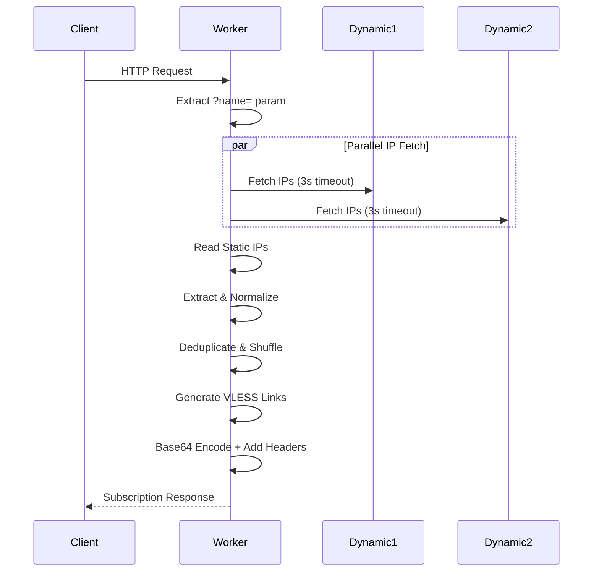
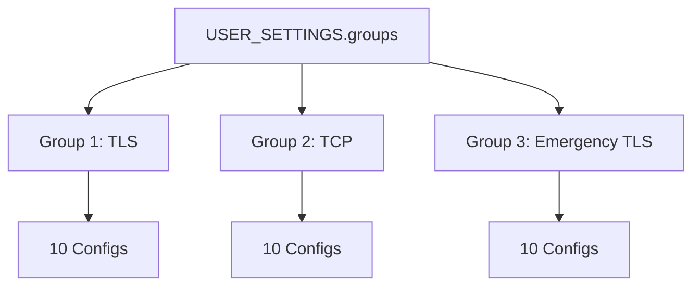
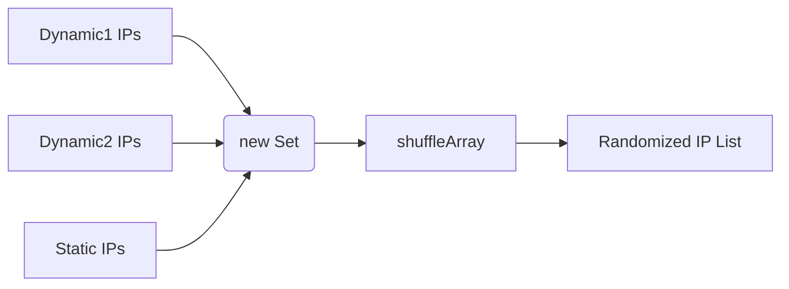

# Architecture Overview

> ⏱️ 10 min · 🟡 Level: Intermediate

Harmony is a **single-file Cloudflare Workers application** that operates as a VLESS subscription generator — it does not proxy traffic itself, but rather produces ready-to-import configuration payloads that V2Ray/Xray-compatible clients consume. When a client hits the worker URL, Harmony executes a complete pipeline: fetch clean IPs → generate VLESS links per configuration group → encode as Base64 → serve with subscription metadata headers. This page dissects that pipeline, the data model, and the execution model that binds them together.

## Repository Structure

The project is intentionally minimal — one runtime file, one static data file, and a VitePress documentation site:

```yaml
Harmony/
├── worker.js       ← Complete runtime (1180 lines)
├── cf-clean.json   ← Statically cached clean IP dataset (18k+ lines)
├── package.json    ← VitePress dev dependencies only
├── LICENSE
├── README.md       ← Persian-language setup guide
└── docs/           ← VitePress documentation site
    ├── index.md    ← Landing page
    ├── 1/
    │   └── overview.md
    └── public/
        └── logo.svg
```

There is no build step for the worker itself — `worker.js` is deployed verbatim to Cloudflare. The `package.json` scripts (`dev`, `build`, `preview`) relate exclusively to the documentation site powered by VitePress.

## High-Level Request Lifecycle

Every invocation of the worker follows the same deterministic path. The Mermaid diagram below illustrates the complete request-to-response flow, with the three parallel IP fetch operations highlighted as the key concurrency point:



The worker entry point is the standard Cloudflare Workers `addEventListener("fetch", ...)` pattern at line 1009. The `handleRequest` function receives the incoming `Request`, extracts an optional `?name=` query parameter for profile titling, then orchestrates the full pipeline.

## Three-Layer Code Architecture

The 1180-line `worker.js` is organized into three distinct layers, each with a clear responsibility boundary:

| Layer | Lines | Responsibility | Mutability |
| --- | --- | --- | --- |
| **User Configuration** | 30–95 | `USER_SETTINGS` object: UUID, `ipCount`, early data, and group definitions | User edits before deploy |
| **Static Data** | 102–971 | `staticIPs` array: ~870 IPv6-mapped addresses + 25 CDN domains + 4 raw IPv4s | User may extend |
| **Runtime Logic** | 973–1180 | IP fetching, VLESS link builder, subscription encoder, utility functions | Never edited by user |

<br/>	 

::: info NOTE
The **User Configuration** layer is the only section a deployer needs to touch — lines 32 (UUID), 55–56 (TLS host/SNI), 69 (TCP host), and 83–84 (emergency host/SNI). Everything below line 95 is infrastructure that operates autonomously.
:::

## Data Model: Configuration Groups

The central data structure is `USER_SETTINGS.groups`, an array of group objects. Each group defines a **distinct VLESS configuration template** that gets multiplied by `ipCount` (default: 10) during generation. The three default groups serve different network strategies:



Each group object contains the following fields, which map directly to VLESS URI parameters:

| Field | Purpose | Example | VLESS URI Param |
| --- | --- | --- | --- |
| `name` | Remark/label shown in client | `"Harmonyᵀᴸˢ"` | `#remark` (fragment) |
| `host` | WebSocket `Host` header | `"index.harmonica01.workers.dev"` | `host=` |
| `sni` | TLS Server Name Indication | Same as host (or empty for non-TLS) | `sni=` |
| `path` | WebSocket path (supports `random:N`) | `"/random:18"` | `path=` |
| `tls` | Enables TLS security layer | `true` / `false` | `security=tls` (if true) |
| `allowInsecure` | Skip TLS verification | `false` | `allowInsecure=1` (if true) |
| `ports` | Candidate ports for connection | `["443","8443","2053",...]` | Port in `@ip:port` |
| `alpn` | Application-Layer Protocol Negotiation | `"http/1.1"` | `alpn=` |
| `fp` | Client fingerprint list | `["chrome"]` | `fp=` |
| `dataSource` | Which IP source to use | `"dynamic1"` | — (determines `@ip`) |
| `randomizeSni` | Randomize SNI character casing | `true` | Affects `sni=` value |

The **output cardinality** is: `groups.length × ipCount` configurations. With defaults (3 groups × 10 IPs), every subscription refresh yields **30 distinct VLESS links**.

## IP Data Pipeline

The IP acquisition pipeline is the most architecturally significant subsystem. It operates in three stages — **fetch**, **extract**, and **prepare** — with a static fallback that guarantees output even when external sources are unreachable.

### Stage 1: Parallel Fetch

Both dynamic sources are fetched concurrently via `Promise.all` with a 3-second timeout per request:

| Source Key | URL | Response Shape | Fallback on Failure |
| --- | --- | --- | --- |
| `dynamic1` | `raw.githubusercontent.com/NiREvil/vless/.../Cloudflare-IPs.json` | `{ ipv4: [{ ip: "..." }] }` | `{ ipv4: [] }` |
| `dynamic2` | `strawberry.victoriacross.ir` | `{ data: [{ ipv4: "..." }] }` | `{ data: [] }` |

The `fetchWithTimeout` wrapper at line 1013 uses `AbortController` to enforce the timeout, ensuring a hung external API never blocks the worker beyond its CPU time limit.

### Stage 2: Extract & Normalize

Each source has a different response schema. The extraction logic at lines 1042–1043 normalizes them into flat string arrays:

- **dynamic1**: `response.ipv4[].ip` — array of objects, extract `.ip` field
- **dynamic2**: `response.data[].ipv4` — array of objects, extract `.ipv4` field

### Stage 3: Deduplicate & Shuffle

All three sources (including `static`) are passed through a two-step preparation:

1. **`new Set(...)`** — removes duplicate IPs within each source
2. **`shuffleArray()`** — Fisher-Yates shuffle for random distribution across configs



<br/>

::: info NOTE
The **static IP list** at lines 102–971 contains IPv6-mapped IPv4 addresses in the format `[::ffff:XXXX:XXXX]`, 25 CDN-backed domains (like `time.is`, `fbi.gov`, `cdnjs.com`), and a few raw IPv4 addresses. These serve as the **zero-dependency fallback** — if both dynamic fetches fail, Group 3 still produces output from static data.
:::

## VLESS Link Builder

The `createVlessLink(ip, group, settings)` function at line 1097 is the core output generator. It transforms a single IP + group template into a complete `vless://` URI:

```text
vless://{uuid}@{ip}:{randomPort}?path={path}&encryption=none&type=ws&host={host}&fp={fp}&ed={ed}&eh={eh}[&security=tls&sni={sni}&alpn={alpn}]#{name}
```

Three randomization mechanisms operate during link construction:

| Mechanism | Implementation | Anti-Detection Purpose |
| --- | --- | --- |
| **Port selection** | Random pick from `group.ports` array | Distributes across Cloudflare edge ports |
| **Path obfuscation** | `random:18` → 18-char random alphanumeric string | Prevents path-based fingerprinting |
| **SNI case randomization** | 50% chance to uppercase each character | Defeats case-sensitive SNI filters |

The TLS conditional block at lines 1125–1138 adds `security=tls`, `sni`, and `alpn` parameters only when `group.tls` is true. For non-TLS groups, these parameters are omitted entirely rather than set to empty values — this is a protocol requirement, not a design choice.

## Subscription Output Format

The final response is a Base64-encoded newline-joined list of VLESS URIs, served with HTTP headers that client applications interpret as subscription metadata:

| Header | Value | Client Behavior |
| --- | --- | --- |
| `Content-Type` | `text/plain; charset=utf-8` | Standard text response |
| `Profile-Update-Interval` | `6` | Client refreshes every 6 hours |
| `Subscription-Userinfo` | Dynamic fake stats | Shows simulated usage in client UI |
| `Profile-Title` | From `?name=` param or `"Harmony"` | Names the subscription profile |

The **fake subscription info** generated by `generateCakeSubscriptionInfo()` at line 991 serves a practical purpose: many V2Ray clients display traffic statistics from the `Subscription-Userinfo` header, and missing or zero values can cause UI glitches. The function produces realistic-looking numbers that vary throughout the day based on the current hour, simulating gradual traffic consumption.

## Utility Layer

Three utility functions support the main pipeline:

- **`generateRandomPath(length)`** — Generates a lowercase-alphanumeric string of the given length using `abcdefghijklmnopqrstuvwxyz0123456789`. Called when a group path contains the `random:N` directive.

- **`randomizeCase(str)`** — Iterates each character with a 50% probability of uppercasing. Applied to SNI values when `group.randomizeSni` is true.

- **`shuffleArray(array)`** — Implements the **Fisher-Yates shuffle** (O(n) in-place) to randomize IP order before configuration generation, ensuring consecutive subscription refreshes produce different IP-to-port mappings.

## Execution Model & Constraints

Harmony runs on the **Cloudflare Workers runtime**, which imposes specific constraints that shaped the architecture:

| Constraint | Impact on Design |
| --- | --- |
| **No persistent storage** | All IP data must be fetched per-request or hardcoded |
| **CPU time limit** (10ms free / 30ms paid) | 3s fetch timeout + Fisher-Yates shuffle is fast enough |
| **Single request scope** | No caching between requests; each refresh is a fresh pipeline run |
| **Subrequest limit** (50 free / 1000 paid) | Only 2 external fetches per invocation — well within limits |
| **No `setTimeout`/`setInterval`** | Timeout implemented via `AbortController` on `fetch()` |

The stateless, per-request execution model means there is **no warm cache** — every client refresh triggers a full IP fetch + config generation cycle. This is by design: it ensures the IP list is always fresh, which is critical for avoiding blocked Cloudflare IPs in restrictive network environments.

## Architectural Summary

| Aspect | Design Decision |
| --- | --- |
| **Deployment target** | Single Cloudflare Worker, no build step |
| **Configuration model** | JavaScript object literal, edited in-source |
| **IP sourcing** | 3-tier: 2 dynamic APIs + 1 static fallback |
| **Concurrency** | `Promise.all` for parallel IP fetches |
| **Output format** | Base64-encoded VLESS URI list |
| **Randomization** | Port, path, and SNI — all per-request |
| **Error strategy** | Graceful degradation: empty arrays on fetch failure, static IPs as last resort |

## Next Steps

Now that you understand the end-to-end architecture, dive into the configuration layer that you'll interact with when deploying:  

→ **[VLESS Configuration Groups](./5-vless-configuration-groups)** — Understand each group field and how to customize them  

→ **[UUID and Hostname Setup](./6-uuid-and-hostname-setup)** — Replace the default identity parameters  

→ **[IP Data Sources](./8-ip-data-sources.md)** — Deep dive into how each IP source works and when to prefer one over another  
