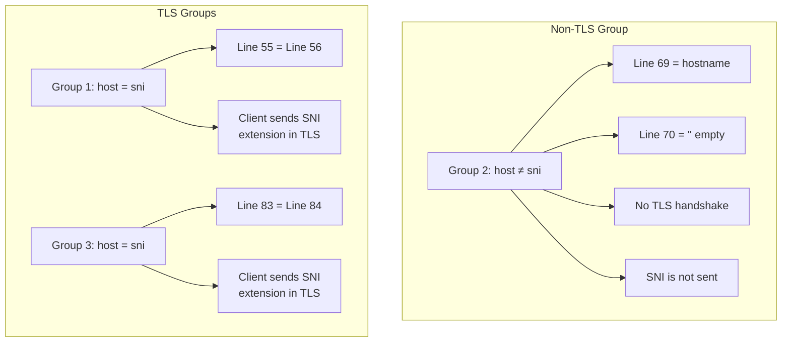

# UUID and Hostname Setup

> ⏱️ 8 min · Level: <Badge type="warning" text="Intermediate" />  

The **UUID** and **hostname** are the two foundational credentials that authenticate and route your VLESS proxy connections. The UUID serves as your single global authentication token — it is shared across every configuration group and embedded directly into each generated VLESS link. The hostname, by contrast, is a **per-group** setting that tells the client which Cloudflare Worker origin to connect to. Getting both values correct is the most critical step in deploying Harmony, because without a valid UUID and matching hostname, every generated configuration will fail to authenticate.

## Where UUID and Hostname Live in the Code

Both values are defined inside the `USER_SETTINGS` object at the top of `worker.js`. The UUID is a **top-level property** shared by all groups, while the hostname is a **nested property** within each group definition. This architectural split is intentional: the UUID represents _who you are_ (authentication), while the hostname represents _where you connect_ (routing) — and different groups may route to different workers.

### Configuration Location Map

| Parameter | Scope | Location in `worker.js` | Used By |
| --- | --- | --- | --- |
| `uuid` | Global (all groups) | Line 32 | `createVlessLink()` — line 1141 |
| `host` | Per-group | Lines 55, 69, 83 | `createVlessLink()` — line 1118 |
| `sni` | Per-group | Lines 56, 70, 84 | `createVlessLink()` — lines 1127–1131 |

## How UUID and Hostname Flow Into VLESS Links

The following diagram traces the data flow from the `USER_SETTINGS` object through to the final VLESS link output. Understanding this flow clarifies why the UUID must be globally unique and why each group's hostname must match an actual deployed Worker.

```mermaid
flowchart LR
    A[USER_SETTINGS.uuid<br/>Line 32] --> D[createVlessLink()<br/>Line 1097]
    B[Group 1: host + sni<br/>Lines 55–56] --> D
    C[Group 2: host + sni<br/>Lines 69–70] --> D
    E[Group 3: host + sni<br/>Lines 83–84] --> D
    D --> F[vless://UUID@IP:PORT?host=...&sni=...]
    F --> G[Base64 Subscription Output]
```

The `createVlessLink()` function at line 1097 consumes both `settings.uuid` and `group.host` to assemble the final VLESS URL. The UUID is placed in the authority segment (`vless://uuid@...`), while the hostname is set as the `host` query parameter — the parameter that the VLESS client uses to set the WebSocket `Host` header and TLS SNI extension during the actual connection handshake.

## Step-by-Step: Setting Your UUID

The UUID is the authentication credential that your VLESS proxy server validates against incoming connections. It must match exactly the UUID you configured in the Worker that serves as your proxy origin.

### 1. Obtain Your UUID

If you already have a working VLESS configuration (from ZiZifn, BPB, or any other VLESS Worker), extract the UUID from that configuration's link. A VLESS link has the format `vless://UUID@hostname:port?...` — the UUID is the segment between `vless://` and `@`.

::: tip TIP
If you don't have one yet, generate a fresh UUID v4 using any standard generator such as [uuidgenerator.net][1]. The format is 8-4-4-4-12 hexadecimal characters, e.g. `a22bff60-a40a-4250-bde2-4c660e363b47`.
:::

### 2. Replace the Default UUID in `worker.js`

Open `worker.js` and locate line 32 inside the `USER_SETTINGS` object. Replace the placeholder value with your own UUID:

| | Value |
| --- | --- |
| **Before** | `uuid: "a22bff60-a40a-4250-bde2-4c660e363b47"` |
| **After** | `uuid: "your-own-uuid-here"` |

::: warning ⚠️ SINGLE POINT OF AUTHENTICATION
The UUID is a **single point of authentication** — all three configuration groups share the same UUID. If you use different Workers with different UUIDs, you must deploy separate Harmony instances for each UUID, or use a UUID that is valid across all your origin Workers.
:::

## Step-by-Step: Setting Your Hostname

The hostname identifies which Cloudflare Worker (or Pages site) will handle the incoming VLESS connection. Unlike the UUID, **each configuration group has its own hostname**, which means you can route different groups through different Workers — a powerful pattern for redundancy or geographic optimization.

### 1. Obtain Your Hostname

Your hostname is the URL assigned to your Cloudflare Worker after deployment. It follows the pattern `<worker-name>.<subdomain>.workers.dev`. You can find it in the Cloudflare dashboard under **Workers & Pages → your worker → Overview → Preview / Triggers**.

### 2. Replace Hostnames Per Group

Open `worker.js` and replace the `host` and `sni` fields for each group that applies to your setup:

| Group | `host` Line | `sni` Line | TLS Mode | Notes |
| --- | --- | --- | --- | --- |
| **Group 1** (TLS) | 55 | 56 | `tls: true` | `host` and `sni` must match your Worker hostname |
| **Group 2** (TCP) | 69 | 70 | `tls: false` | `host` = your Worker hostname; `sni` **must be empty** |
| **Group 3** (Alt TLS) | 83 | 84 | `tls: true` | `host` and `sni` must match your Worker hostname |

<br/>



<br/>

### Before and After Example

| Field | Default (Group 1) | Your Config |
| --- | --- | --- |
| `host` | `"index.harmony.workers.dev"` | `"your-worker.your-subdomain.workers.dev"` |
| `sni` | `"index.harmony.workers.dev"` | `"your-worker.your-subdomain.workers.dev"` |

## The Hostname–SNI Relationship

::: warning ⚠️ CRITICAL RULE
For configurations hosted on Cloudflare Workers or Pages, the **SNI (Server Name Indication) must always equal the hostname**. This is because Cloudflare's edge uses the SNI value in the TLS ClientHello to determine which origin to route the connection to. If SNI and hostname diverge, Cloudflare will either reject the handshake or route to the wrong origin.
:::

The only exception is **non-TLS (TCP) groups**, where there is no TLS handshake at all — and therefore SNI is meaningless. For these groups, the `sni` field must be an empty string (`""`), and the `alpn` field must also be empty. Harmony enforces this at the code level: when `group.tls` is `false`, the `security` and `sni` query parameters are simply omitted from the generated VLESS link.

| Scenario | `host` Value | `sni` Value | Why |
| --- | --- | --- | --- |
| TLS group (Workers) | Worker hostname | **Same as `host`** | Cloudflare routes by SNI |
| TLS group (Custom Domain) | Custom domain | **Same as `host`** | DNS must point to Cloudflare |
| Non-TLS / TCP group | Worker hostname | `""` (empty) | No TLS handshake → no SNI |

::: info SNI CASE RANDOMIZATION
When `randomizeSni` is `true` (the default for TLS groups), Harmony randomizes the **character casing** of the SNI value (e.g., `InDeX.HaRmOny.WoRkErS.DeV`) before embedding it in the VLESS link. This is a censorship-resistance technique — the randomized casing is still DNS-equivalent but defeats naive string-matching filters. The hostname (`host` parameter) is never randomized.
:::

## Multi-Worker and Multi-Origin Patterns

Because hostname is a per-group setting, Harmony supports advanced deployment patterns where each group routes through a **different origin**:

- **Same UUID, different Workers** — All groups authenticate with the same UUID, but Group 1 connects through `worker-a.workers.dev` while Group 3 connects through `worker-b.workers.dev`. This provides geographic or redundancy diversity.
- **Same Worker, different groups** — All groups share one hostname but differ in TLS mode, ports, or IP sources. This is the simplest setup and matches the default configuration.
- **Workers + Pages hybrid** — You can use a `*.workers.dev` hostname for TLS groups and a `*.pages.dev` hostname for others (note: non-TLS TCP groups only work with Workers, not Pages).

## Troubleshooting

| Symptom | Likely Cause | Fix |
| --- | --- | --- |
| All configs fail to connect | UUID doesn't match the origin Worker | Verify the UUID in `worker.js` line 32 matches the UUID in your proxy Worker |
| TLS configs fail, TCP works | `sni` doesn't match the hostname | Set `sni` equal to `host` for all TLS groups |
| Connection immediately drops | Hostname points to non-existent Worker | Verify the Worker is deployed and the hostname is correct in the Cloudflare dashboard |
| `sni` error in client log | Non-empty SNI on non-TLS group | Set `sni: ""` and `alpn: ""` for TCP groups (line 70, 75) |
| UUID format error | Invalid UUID string format | Ensure UUID follows `xxxxxxxx-xxxx-4xxx-yxxx-xxxxxxxxxxxx` format (v4) |

<br/>

## Next Steps
With your UUID and hostname properly configured, the next critical settings to understand are the **port assignments** and **ALPN protocol negotiation**, which determine how the TLS handshake is constructed and which Cloudflare edge ports are available for your connections.  

→ Continue to **[Ports and ALPN Settings](./7-ports-and-alpn-settings)**  

If you'd like to understand the broader group architecture before diving into ports, see **[VLESS Configuration Groups](./5-vless-configuration-groups)**.  

[1]: https://uuidgenerator.net