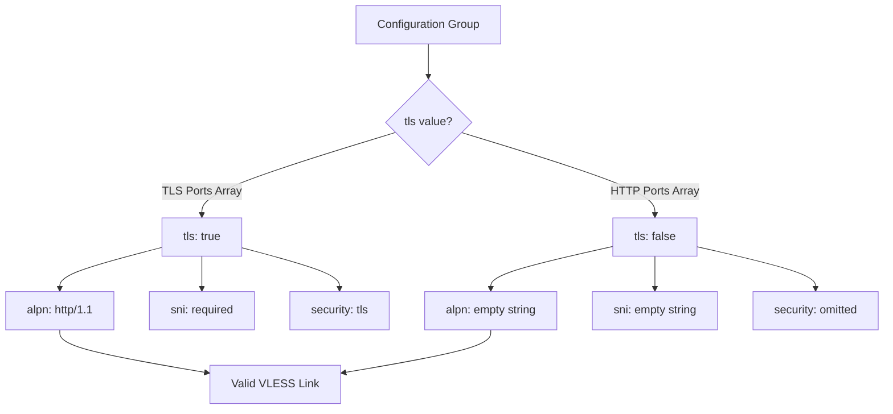

# Ports and ALPN Settings

> ⏱️ 8 min · Level: <Badge type="danger" text="Advanced" />  

Ports and ALPN (Application-Layer Protocol Negotiation) are two tightly coupled parameters that define **how** VLESS connections traverse Cloudflare's edge network. Ports determine the transport entry point, while ALPN negotiates the application protocol during the TLS handshake. In Harmony, both are defined per configuration group and carry strict compatibility constraints — a mismatch between port type and TLS/ALPN settings will produce non-functional configurations.

## Cloudflare Proxy Port Landscape

Cloudflare's reverse proxy only forwards traffic on a fixed set of ports. Any port outside these sets is silently dropped at the edge, making the connection unreachable. Harmony exposes these as per-group arrays from which a **single port is randomly selected** at subscription generation time, distributing clients across multiple entry points to reduce single-port congestion and detection surface.

| Category | Ports | Protocol Stack | Cloudflare Behavior |
| --- | --- | --- | --- |
| **TLS/HTTPS** | `443`, `8443`, `2053`, `2083`, `2087`, `2096` | TCP → TLS → WebSocket | Full TLS termination; ALPN negotiation occurs |
| **HTTP/TCP** | `80`, `8080`, `8880`, `2052`, `2082`, `2086`, `2095` | TCP → WebSocket | No TLS; plaintext WebSocket upgrade |

::: info NOTE
These six TLS ports and seven HTTP ports are the **complete** set of ports Cloudflare proxies for Workers traffic. No other ports will route to your Worker, regardless of configuration.
:::

## Port Configuration Per Group

Each group in `USER_SETTINGS.groups` declares a `ports` array. The default configuration demonstrates the canonical port assignment strategy:

**Group 1 — TLS (Harmonyᵀᴸˢ):** All six Cloudflare TLS ports are listed, maximizing port diversity for TLS-terminated connections.

```javascript
ports: ["443", "8443", "2053", "2083", "2087", "2096"],
```

**Group 2 — Non-TLS/TCP (Harmonyᵀᶜᴾ):** All seven Cloudflare HTTP ports are listed for plaintext WebSocket connections. This group is Workers-only — Cloudflare Pages does not support non-TLS routing.

```javascript
ports: ["80", "8080", "8880", "2052", "2082", "2086", "2095"],
```

**Group 3 — Alternative TLS (Harmonyᴱᴹˢ):** A minimal two-port subset (`443`, `2053`) is used, demonstrating that you need not include every available port — a focused subset can be preferable for environments where only standard ports are allowed through firewalls.

```javascript
ports: ["443", "2053"],
```

::: tip TIP
Port values are stored as strings, not numbers. This is intentional — the VLESS URI template requires the port as a string segment in `vless://uuid@ip:port?params#name`, and string storage avoids implicit type coercion issues during link assembly.
:::

## Random Port Selection at Runtime

Port selection is **non-deterministic** per configuration link. During `createVlessLink` execution, one port is randomly sampled from the group's array:

```javascript
const randomPort = group.ports[Math.floor(Math.random() * group.ports.length)];
```

This means that across `ipCount` configurations generated per group, each VLESS link independently picks a port. With six TLS ports and `ipCount: 10`, you'll get an approximately uniform distribution — roughly 1–2 configs per port per subscription refresh. This randomization serves two purposes: **load distribution** across Cloudflare edge entry points, and **detection resistance** by avoiding a single static port fingerprint across all configs.

The selected port is embedded directly into the VLESS URI:

```javascript
return `vless://${settings.uuid}@${ip}:${randomPort}?${queryParams.toString()}#${ps}`;
```

## ALPN Protocol Negotiation

ALPN is a TLS extension that lets the client and server agree on the application protocol during the handshake, before any application data flows. For VLESS-over-WebSocket configurations, the only viable ALPN value is **`http/1.1`**, because WebSocket upgrade requires an HTTP/1.1 request-response cycle. HTTP/2 and HTTP/3 ALPN values are incompatible with the WebSocket upgrade mechanism.

### ALPN Configuration Per Group

| Group | `tls` | `alpn` Value | Rationale |
| --- | --- | --- | --- |
| Harmonyᵀᴸˢ | `true` | `"http/1.1"` | TLS group; WebSocket requires HTTP/1.1 negotiation |
| Harmonyᵀᶜᴾ | `false` | `""` (empty) | Non-TLS group; no TLS handshake → no ALPN negotiation possible |
| Harmonyᴱᴹˢ | `true` | `"http/1.1"` | TLS group; same WebSocket constraint |

### Conditional ALPN Injection

ALPN is not unconditionally written into every VLESS link. The `createVlessLink` function applies it only when both conditions are met:

```javascript
if (group.tls) {
    queryParams.set("security", "tls");
    // ... SNI handling ...
    if (group.alpn) {
        queryParams.set("alpn", group.alpn);
    }
}
```

::: warning ⚠️ DOUBLE-GATE CHECK
This double-gate — `group.tls === true` **and** `group.alpn` is truthy — ensures that non-TLS groups never emit an `alpn` query parameter. An ALPN value on a non-TLS connection is semantically meaningless (there is no TLS handshake to carry it) and will cause V2Ray/Xray cores to reject the configuration.
:::

## Port-TLS-ALPN Compatibility Matrix

The three parameters form a strict invariant. Violating any constraint produces a broken configuration:

| Port Category | Required `tls` | Required `alpn` | Valid `alpn` Values | Invalid `alpn` Values |
| --- | --- | --- | --- | --- |
| TLS ports (443, 8443, 2053, 2083, 2087, 2096) | `true` | Must be set | `"http/1.1"` | `""`, `"h2"`, `"h3"` |
| HTTP ports (80, 8080, 8880, 2052, 2082, 2086, 2095) | `false` | Must be empty | `""` | Any non-empty string |



::: warning ⚠️ COMMON MISCONFIGURATION
When customizing groups, always validate the invariant: TLS ports require `tls: true` + non-empty `alpn`, and HTTP ports require `tls: false` + empty `alpn`. A common misconfiguration is adding `"443"` to a non-TLS group's port array — this will produce links that appear valid but cannot establish connections.
:::

## Customizing Port Lists

Port arrays are fully editable. Common customization scenarios:

**Reducing port surface:** Some network environments block non-standard ports. Restricting to the most commonly allowed ports minimizes connection failures:

```javascript
// Conservative TLS — only universally allowed ports
ports: ["443", "8443"],
alpn: "http/1.1",

// Conservative HTTP — only the standard HTTP port
ports: ["80", "8080"],
alpn: "",
```

**Single-port locking:** For environments with strict egress firewall rules where only one port is permitted:

```javascript
// Lock to port 443 only
ports: ["443"],
alpn: "http/1.1",
```

::: info NOTE
When a single port is specified, the random selection at line 1099 always returns that port, effectively making it static across all generated configs in the group.
:::

**Adding redundancy with duplicate ports:** You can weight port selection by duplicating entries. With `ports: ["443", "443", "8443"]`, approximately 67% of configs will use port 443 and 33% will use port 8443.

## ALPN Beyond http/1.1

While `"http/1.1"` is the only functional ALPN value for VLESS-WebSocket configurations in Harmony, the V2Ray/Xray core supports additional ALPN values for other transport types. The following table documents the full ALPN landscape for reference, but only `http/1.1` is compatible with Harmony's WebSocket transport:

| ALPN Value | Transport Compatibility | Works in Harmony | Reason |
| --- | --- | --- | --- |
| `http/1.1` | WebSocket over TLS | ✅ | WebSocket upgrade requires HTTP/1.1 framing |
| `h2` | gRPC over TLS | ❌ | Harmony uses `type: ws`, not `type: grpc` |
| `h3` | QUIC-based transport | ❌ | Cloudflare Workers do not proxy QUIC to origin |
| `""` (empty) | Non-TLS connections | ✅ (non-TLS groups only) | No TLS handshake → no ALPN negotiation |

<br/>

::: warning ⚠️ INCOMPATIBILITY WARNING
Attempting to set `alpn: "h2"` in a Harmony group will produce VLESS links that parse correctly but fail at connection time — the Xray core will negotiate HTTP/2 with Cloudflare's edge, which cannot upgrade an HTTP/2 stream to WebSocket.
:::

## Complete Group Parameter Flow

The following diagram shows how `ports` and `alpn` flow from group definition through to the final VLESS URI:

```mermaid
flowchart LR
    subgraph "TLS Path"
        A1[Group Config] --> B1{tls === true}
        B1 --> C1[group.ports array]
        C1 --> D1[randomPort = ports[random index]]
        B1 --> E1[group.tls boolean]
        B1 --> F1[group.alpn "http/1.1"]
        D1 --> G1[vless://uuid@ip:randomPort?params]
        E1 --> H1[security=tls]
        F1 --> I1[alpn=http/1.1]
        F1 --> J1[sni=<value>]
    end
    
    subgraph "Non-TLS Path"
        A2[Group Config] --> B2{tls === false}
        B2 --> C2[group.ports array]
        C2 --> D2[randomPort = ports[random index]]
        B2 --> E2[group.alpn "" — ignored]
        D2 --> G2[vless://uuid@ip:randomPort?params]
        E2 --> H2[security omitted]
        E2 --> I2[alpn omitted]
        E2 --> J2[sni omitted]
    end
```

## Next Steps
Now that you understand port and ALPN constraints, explore how clean IPs are sourced for these configurations in **[IP Data Sources](./8-ip-data-sources)**, or learn about the VLESS link assembly process in **[VLESS Link Builder](./11-vless-link-builder)**.  