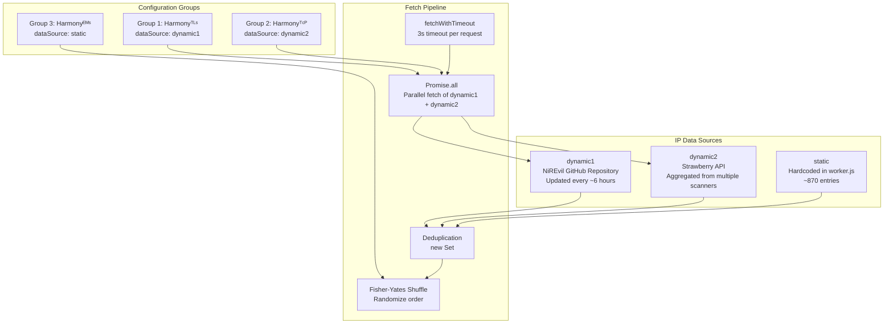
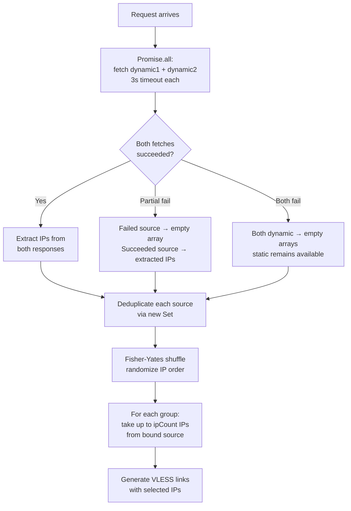

# IP Data Sources

> ⏱️ 8 min · 🟡 Level: Intermediate

Harmony's IP data pipeline is the mechanism that supplies **clean Cloudflare IPs** to each VLESS configuration group. Rather than relying on a single source, the system implements a **three-tier source architecture** — two dynamic remote APIs and one hardcoded static fallback — so that subscription generation remains resilient even when external services are unreachable. Each configuration group independently declares which source it consumes via the `dataSource` property, giving you per-group control over IP provenance and freshness.

## 🏗️ Source Architecture Overview

The three sources are not independent alternatives in a fallback chain; instead, each group **binds to exactly one source** at configuration time. This design trades automatic redundancy for explicit control — you always know where a group's IPs originated.



<br/>

## 🌐 The Three Sources

### `dynamic1` — NiREvil GitHub Repository

This source points to a JSON file hosted on the NiREvil GitHub repository, scanned and refreshed approximately every **6 hours** by an automated IP scanner. It returns a structured payload where each entry contains a `domain`, an `ip` (IPv4), an `ipv6`, a `short_ipv6`, an `is_ir` flag (indicating Iranian-origin domains), and a `protocol_version` (typically `TLSv1.3`). The worker extracts only the `ip` field from each object.

| Property | Value |
| --- | --- |
| **URL** | `https://raw.githubusercontent.com/NiREvil/vless/refs/heads/main/Cloudflare-IPs.json` |
| **Response structure** | `{ ipv4: [{ domain, ip, ipv6, short_ipv6, is_ir, protocol_version }, ...] }` |
| **Extraction path** | `response.ipv4[].ip` |
| **Update frequency** | ~6 hours (external scanner) |
| **Local mirror** | `cf-clean.json` in the repository root |

::: info NOTE
The `cf-clean.json` file in the repository root mirrors this source's schema — it is **not read by the worker at runtime**, but serves as a local snapshot for inspection and manual extraction.
:::

### `dynamic2` — Strawberry API

This source is a self-hosted aggregation API that collects clean Cloudflare IPs from multiple upstream scanners. Its response uses a different schema than `dynamic1`: the top-level key is `data` (not `ipv4`), and each item exposes the IPv4 address directly as an `ipv4` string field.

| Property | Value |
| --- | --- |
| **URL** | `https://strawberry.victoriacross.ir` |
| **Response structure** | `{ data: [{ ipv4, ... }, ...] }` |
| **Extraction path** | `response.data[].ipv4` |
| **Update frequency** | Continuous (aggregation API) |

::: info NOTE: SCHEMA DIVERGENCE
Because the two dynamic sources use **different response schemas**, the extraction logic branches: `dynamic1` maps over `.ipv4[].ip` while `dynamic2` maps over `.data[].ipv4`. This schema divergence is intentional — it ensures that a structural change in one API cannot break both sources simultaneously.
:::

### `static` — Hardcoded Fallback

The `staticIPs` array contains approximately **870 entries** hard-coded directly into `worker.js`. These entries fall into two categories:

1.  **IPv6-mapped IPv4 addresses** — formatted as `[::ffff:XXXX:XXXX]`, these are the dominant format in the array and represent Cloudflare anycast IPs encoded as IPv6-mapped IPv4 for compatibility with VLESS clients that accept this notation.
2.  **Plain IPv4 addresses** — standard dotted-decimal Cloudflare IPs (e.g., `104.16.0.235`, `172.67.69.223`, `188.114.99.4`), appearing later in the array.

This source requires **zero network requests** and is therefore immune to fetch failures, timeouts, and API downtime. It serves as the definitive fallback for environments with unreliable connectivity.

| Property | Value |
| --- | --- |
| **Location** | `staticIPs` array in `worker.js` |
| **Total entries** | ~870 (IPv6-mapped + plain IPv4) |
| **Network dependency** | None |
| **Primary role** | Fallback when dynamic sources fail |

::: danger INFO: ZERO-LATENCY RESOLUTION
The static IP list is not merely a backup — assigning `dataSource: "static"` to a group guarantees **zero-latency IP resolution** since no external fetch occurs. This makes it ideal for emergency groups where reliability trumps freshness.
:::

## 🔗 Source-to-Group Binding

Each group in `USER_SETTINGS.groups` declares its source via the `dataSource` property. The default configuration distributes sources across groups for maximum diversity:

| Group | Name | `dataSource` | Rationale |
| --- | --- | --- | --- |
| Group 1 | Harmonyᵀᴸˢ | `dynamic1` | TLS group benefits from freshest scanned IPs |
| Group 2 | Harmonyᵀᶜᴾ | `dynamic2` | TCP group uses independent API for source diversity |
| Group 3 | Harmonyᴱᴹˢ | `static` | Emergency group must work without network fetches |

::: info INFO
This distribution ensures that a failure in any **single** external source still leaves two groups operational with IPs from the remaining sources.
:::

## ⚙️ Fetch and Processing Pipeline

When a subscription request arrives, the worker executes the following pipeline:



<br/>

### Step-by-Step Breakdown

1.  **Parallel fetch** — Both dynamic URLs are fetched simultaneously using `Promise.all` with a **3-second timeout** per request via `fetchWithTimeout`. The static source requires no fetch.

2.  **Graceful degradation** — If a dynamic fetch fails (network error, timeout, invalid JSON), the catch handler returns an empty array structure (`{ ipv4: [] }` or `{ data: [] }`), ensuring the pipeline never crashes.

3.  **Schema-aware extraction** — Each dynamic source's response is mapped through its specific extraction path:
    -   `dynamic1`: `response.ipv4.map(entry => entry.ip).filter(Boolean)`
    -   `dynamic2`: `response.data.map(entry => entry.ipv4).filter(Boolean)`
4.  **Deduplication** — Each source's IP list is passed through `new Set()` to eliminate duplicates, then spread back into an array.

5.  **Fisher-Yates shuffle** — The deduplicated array is randomized using the Fisher-Yates algorithm, ensuring that each subscription refresh returns IPs in a different order, distributing load across Cloudflare's anycast network.

6.  **Per-group consumption** — Each group reads from its bound source and takes up to `ipCount` (default: 10) unique IPs, generating one VLESS link per IP.

## 🛠️ Configuring a Custom Source

To assign a different source to a group, modify the `dataSource` property in the group definition:

```javascript
// Example: Switch Group 1 from dynamic1 to static
{
  name: "Harmonyᵀᴸˢ",
  host: "index.harmonica01.workers.dev",
  // ... other settings ...
  dataSource: "static",  // Changed from "dynamic1" to "static"
}
```

::: warning ⚠️ INVALID VALUES
The valid values for `dataSource` are exactly the keys present in the `ipDataSources` object constructed at runtime: `"static"`, `"dynamic1"`, and `"dynamic2"`. Any unrecognized value resolves to an empty array (via the `|| []` fallback at line 1054), silently producing zero configs for that group.
:::

To add a brand-new dynamic source, you must define its URL in `ipSourceURLs`, add a fetch+extraction step in the `handleRequest` function, and register it in the `ipDataSources` object. The `dataSource` property in groups will then accept the new key as a valid value.

## 📋 Response Schema Reference

The `cf-clean.json` file provides a local reference for the `dynamic1` schema. Each entry in its `ipv4` array follows this structure:

| Field | Type | Description |
| --- | --- | --- |
| `domain` | `string` | Cloudflare-backed domain that resolves to this IP |
| `ip` | `string` | IPv4 address (e.g., `"104.16.0.223"`) |
| `ipv6` | `string` | Full IPv6 address (e.g., `"2a06:98c1:3120::3"`) |
| `short_ipv6` | `string` | Compressed IPv6-mapped representation (e.g., `"::ffff:bc72:613"`) |
| `is_ir` | `boolean` | Whether the domain is Iranian-origin (`true`) or generic (`false`) |
| `protocol_version` | `string` | TLS protocol version, typically `"TLSv1.3"` |

## 📊 Source Comparison Summary

| Characteristic | `static` | `dynamic1` | `dynamic2` |
| --- | --- | --- | --- |
| **Network request** | None | GitHub raw content | Strawberry API |
| **Latency** | 0 ms | ~100–500 ms | ~100–500 ms |
| **Failure mode** | None (hardcoded) | Empty array on timeout/error | Empty array on timeout/error |
| **IP freshness** | Static (code update required) | ~6 hour refresh cycle | Continuous aggregation |
| **Typical IP count** | ~870 | Varies (hundreds) | Varies (hundreds) |
| **IPv6-mapped format** | Yes (`[::ffff:...]`) | No (plain IPv4) | No (plain IPv4) |
| **Best used for** | Emergency/fallback groups | Primary TLS groups | Primary non-TLS groups |

## 💠 Next Steps

Learn how the static IP list is curated and how to customize it for your region in **[Static IP Fallback Strategy](./9-static-ip-fallback-strategy.md)**, or explore the runtime fetch mechanics in depth at **[Dynamic IP Fetching Pipeline](./10-dynamic-ip-fetching-pipeline.md)**.  
