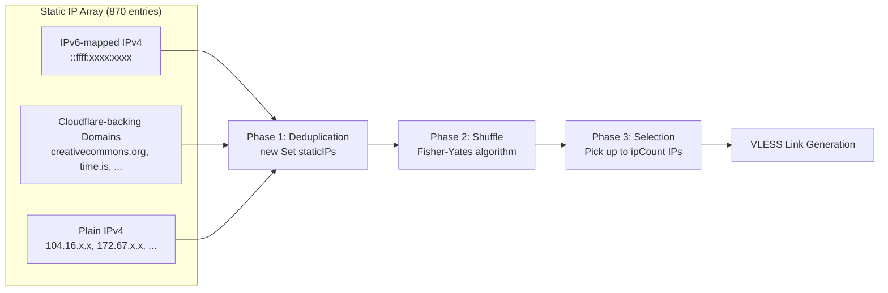
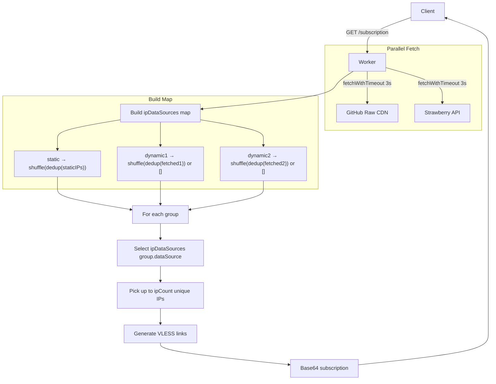

# Static IP Fallback Strategy

> ⏱️ 9 min · 🔴 Level: Advanced

The **static IP fallback strategy** is Harmony's zero-dependency resilience layer — a hardcoded reservoir of ~870 Cloudflare clean IPs and domains embedded directly in `worker.js` that guarantees subscription generation even when external IP sources are unreachable. Unlike the dynamic pipelines that require outbound fetch requests, this strategy is **instantly available at runtime**, requires no network calls, and serves as both an explicit data source and an implicit safety net for the entire IP provisioning system.

## ⚙️ How It Works: The Three-Phase Pipeline

When a configuration group declares `dataSource: "static"`, the static IP list undergoes a deterministic three-phase transformation before IPs are injected into VLESS links:



- **Phase 1 — Deduplication**: The `new Set()` constructor eliminates duplicate entries, which can accumulate in the hardcoded list over time. This is a lightweight O(n) pass that preserves insertion order before shuffling.

- **Phase 2 — Fisher-Yates Shuffle**: The deduplicated array is randomized using the Fisher-Yates algorithm, producing an unbiased permutation where every possible ordering is equally likely. This is critical — without shuffle, clients would always receive the same IP ordering, creating predictable traffic patterns and potential single-IP hotspots.

- **Phase 3 — IP Count Selection**: The shuffled list is iterated with a `uniqueIPs.size >= ipCount` guard (default: 10), consuming only the first N unique IPs needed for the group's configuration output.

<br/>

## 🗂️ The Three Address Categories

The `staticIPs` array is a heterogeneous collection spanning three distinct address formats, each serving a specific purpose in the Cloudflare connectivity chain:

| Category | Format | Count | Example | Resolution Path |
| --- | --- | --- | --- | --- |
| **IPv6-mapped IPv4** | `[::ffff:HHHH:HHHH]` | ~618 | `[::ffff:6810:31f]` | Decoded to IPv4 by VLESS client; used as direct edge IP |
| **Domain names** | FQDN string | ~26 | `time.is`, `fbi.gov` | DNS-resolved by Cloudflare edge at connection time |
| **Plain IPv4** | Dotted decimal | ~226 | `104.16.148.32` | Used directly as Cloudflare edge IP |

### IPv6-Mapped IPv4 Addresses

The dominant format in the static list is the **IPv6-mapped IPv4** notation `[::ffff:xxxx:xxxx]`. These are not true IPv6 addresses — the `::ffff:` prefix is the standard IPv4-mapped IPv6 address format defined in RFC 4291. Each hex pair in the suffix encodes one octet of the underlying IPv4 address. For example, `[::ffff:6810:31f]` decodes to `104.16.3.31`:

- `68` → `104`
- `10` → `16`
- `031f` → `3.31`

::: danger INFO: `RUNTIME COMPATIBILITY`  
This format is used because **Cloudflare Workers internally represent IPv4 addresses as IPv6-mapped addresses** when connecting through `fetch()`. Storing them in this format avoids conversion overhead and ensures direct compatibility with the Workers runtime networking stack.
:::

### Domain Names as Clean IP Proxies

Starting at line 720, the array transitions to domain names — well-known sites that are **behind Cloudflare's CDN**. When a VLESS client connects to `time.is` or `creativecommons.org`, Cloudflare's edge receives the TLS handshake with the Worker's hostname via SNI, and routes the WebSocket upgrade to the correct Worker. The client never directly resolves these domains; instead, the domain's Cloudflare-assigned IP becomes the effective clean IP.

::: tip TIP: `ANYCAST PROPERTY`
This approach leverages a fundamental property of Cloudflare's anycast network: **any domain on Cloudflare shares the same edge IP pools**. The domain is merely a vehicle to reach a Cloudflare edge that can proxy the connection to your Worker.
:::

### Plain IPv4 Addresses

The final section (lines 747–971) contains **direct Cloudflare edge IPv4 addresses** across five CIDR ranges:

| CIDR Range | Cloudflare Purpose | Sample Count in List |
| --- | --- | --- |
| `104.16.0.0/12` | Primary anycast edge | ~70 |
| `104.17.0.0/16` | Secondary edge | ~10 |
| `104.18–26.0.0/16` | Extended edge | ~10 |
| `162.159.0.0/16` | Infrastructure / edge | ~30 |
| `172.64–67.0.0/16` | Large anycast pool | ~60 |
| `188.114.96–99.0/0` | Additional edge | ~30 |

These are the most straightforward entries — the VLESS client connects directly to the IP, bypassing DNS entirely. They represent **known-clean Cloudflare edge IPs** that are not blocked or throttled by the user's ISP.

## 🎛️ Configuration: Activating the Static Strategy

The static IP strategy is activated per-group through the `dataSource` property in `USER_SETTINGS.groups`. Group 3 in the default configuration demonstrates this:

```javascript
{
  name: "Harmonyᴱᴹˢ",
  host: "ems.nscl.workers.dev",
  sni: "ems.nscl.workers.dev",
  path: "/random:14?ed=2048",
  tls: true,
  allowInsecure: false,
  ports: ["443", "2053"],
  alpn: "http/1.1",
  fp: ["chrome"],
  dataSource: "static", // ← Selects the staticIPs array
  randomizeSni: true,
}
```

The `dataSource` field accepts three values, each mapping to a key in the `ipDataSources` object constructed at runtime:

| `dataSource` Value | Resolution | Network Dependency | Latency |
| --- | --- | --- | --- |
| `"static"` | `shuffleArray([...new Set(staticIPs)])` | **None** | ~0ms (in-memory) |
| `"dynamic1"` | Fetch from NiREvil GitHub repo | GitHub raw CDN | ~200-500ms |
| `"dynamic2"` | Fetch from Strawberry API | External API | ~200-500ms |

::: tip TIP: `MIXED CONFIGURATION`
Each group selects its data source **independently**. This means you can run a mixed configuration where Group 1 uses `dynamic1` for fresh IPs, Group 2 uses `dynamic2` for diversity, and Group 3 uses `static` as your always-available fallback — all within a single subscription response.
:::

## 🔄 The Runtime Resolution Flow

At request time, the worker constructs the `ipDataSources` map **after** attempting to fetch dynamic sources. The static list is always prepared regardless of whether dynamic fetches succeed or fail:



::: warning ⚠️ `CRITICAL ARCHITECTURAL DETAIL`
The `static` key in `ipDataSources` is **unconditionally populated** at line 1047. While `dynamic1` and `dynamic2` can degrade to empty arrays if their fetches fail (the `.catch(() => ({ ipv4: [] }))` and `.catch(() => ({ data: [] }))` handlers), the static source is **always available**. This makes it the only data source that can never fail.
:::

## 🛡️ Why Static Fallback Exists: Failure Mode Analysis

The static IP strategy exists to counter a specific failure mode: **network-constrained environments where outbound fetch requests to GitHub or external APIs are blocked, throttled, or timing out**. In such conditions:

1. `fetchWithTimeout(ipSourceURLs.dynamic1, 3000)` aborts after 3 seconds → `.catch()` returns `{ ipv4: [] }`
2. `fetchWithTimeout(ipSourceURLs.dynamic2, 3000)` aborts after 3 seconds → `.catch()` returns `{ data: [] }`
3. Both `dynamic1` and `dynamic2` resolve to **empty arrays**
4. Groups depending on those sources produce **zero VLESS configurations**
5. Only the `static`-sourced group survives, ensuring the subscription always returns at least `ipCount` usable configs

| Scenario | dynamic1 | dynamic2 | static | Total Configs |
| --- | --- | --- | --- | --- |
| All sources available | 10 IPs | 10 IPs | 10 IPs | **30** |
| dynamic1 blocked | 0 IPs | 10 IPs | 10 IPs | **20** |
| Both dynamics blocked | 0 IPs | 0 IPs | 10 IPs | **10** |
| Static-only deployment | — | — | 10 IPs | **10** |

::: warning ⚠️ RESILIENCE WARNING
For maximum resilience, keep at least one group on `dataSource: "static"` in your configuration. If all three groups use dynamic sources and the worker's runtime environment loses external connectivity, the subscription will return an empty configuration list — a complete outage that the static fallback prevents.
:::

## 🛠️ Customizing the Static IP List

The `staticIPs` array is fully editable. You can add or remove entries to match your region's clean IP landscape:

**Adding a domain behind Cloudflare:**

```javascript
const staticIPs = [
  // ... existing entries ...
  "your-cloudflare-site.com",   // Domain resolves to a Cloudflare edge IP
];
```

**Adding a known-clean IPv4:**

```javascript
const staticIPs = [
  // ... existing entries ...
  "104.17.100.50", // Direct Cloudflare edge IP
];
```

**Adding an IPv6-mapped IPv4:**

```javascript
const staticIPs = [
  // ... existing entries ...
  "[::ffff:681a:1234]",  // Encodes 104.26.18.52
];
```

::: info INFO: `SAFE DUPLICATES`
The deduplication step (`new Set()`) means adding duplicate entries is harmless — they'll be collapsed automatically. The shuffle step ensures that even if you add IPs in a fixed order, the output distribution varies per request.
:::

## ⚖️ Static vs. Dynamic: Strategic Trade-offs

| Dimension | Static | Dynamic |
| --- | --- | --- |
| **Availability** | Always (in-memory) | Network-dependent |
| **Freshness** | Stale until code redeploy | Updated every 6 hours by upstream scanners |
| **Latency** | 0ms (no fetch) | 200–500ms per source |
| **IP Diversity** | Fixed pool (~870 entries) | Variable pool (hundreds to thousands) |
| **Maintenance** | Manual code edits | Fully automatic |
| **Censorship Resistance** | IPs may become dirty over time | Freshly scanned clean IPs replace dirty ones |
| **Worker CPU Cost** | Minimal (shuffle + dedup) | Minimal + fetch overhead |
| **Deployment Complexity** | Zero — just deploy | Requires outbound fetch permissions |

::: warning ⚠️ `STALENESS WEAKNESS`
The static list's primary weakness is **staleness**: Cloudflare periodically rotates edge IPs, and ISPs may add IPs to blocklists. A static IP that was clean at deploy time may become dirty weeks later. This is why the default configuration uses `static` only for Group 3 — it's the emergency backup, not the primary IP source.
:::

::: tip `STATIC-ONLY DEPLOYMENT`
For environments where you **cannot rely on external fetch** (e.g., Workers in restricted zones, or when you want zero-latency subscription generation), setting all groups to `dataSource: "static"` is a valid deployment pattern. Just plan to **redeploy the worker periodically** with an updated `staticIPs` array to refresh the pool.
:::

<br/>

## 💠 Next Steps

- Understand how the dynamic sources complement this fallback: **[Dynamic IP Fetching Pipeline](./10-dynamic-ip-fetching-pipeline.md)**  
- Learn how selected IPs become VLESS links: **[VLESS Link Builder](./11-vless-link-builder.md)**  
- See how all groups merge into subscription output: **[Base64 Subscription Output](./12-base64-subscription-output.md)**  